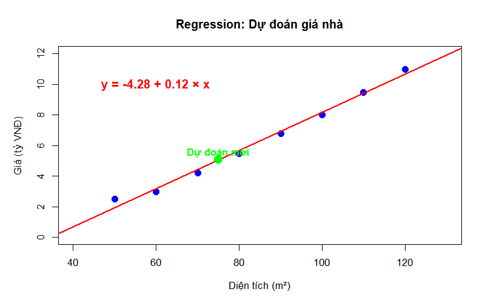
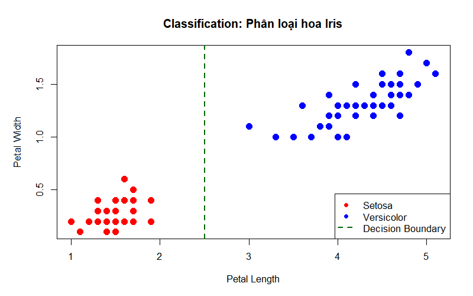
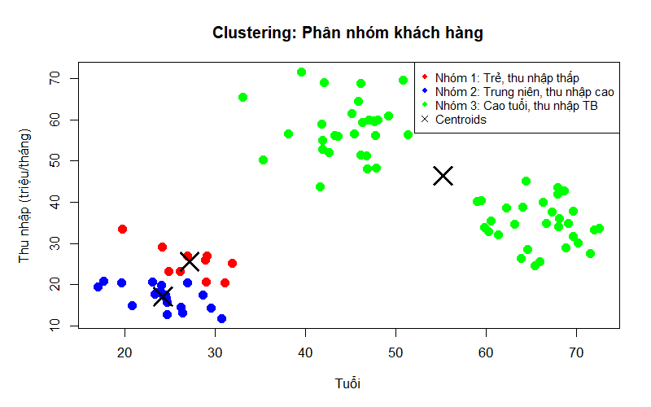
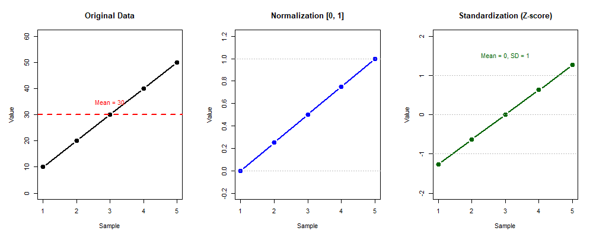
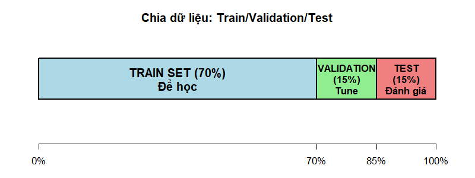
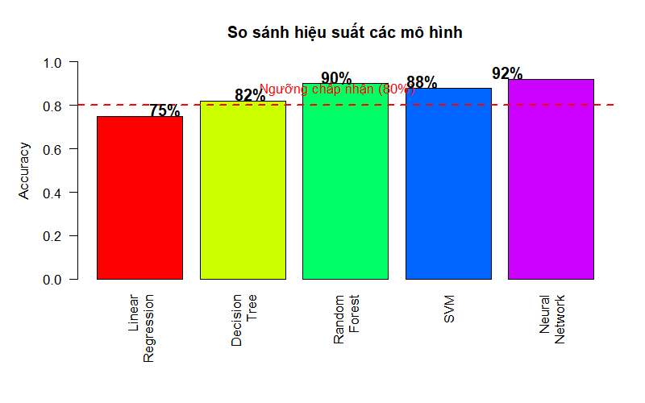
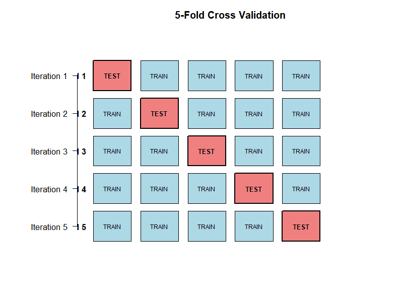
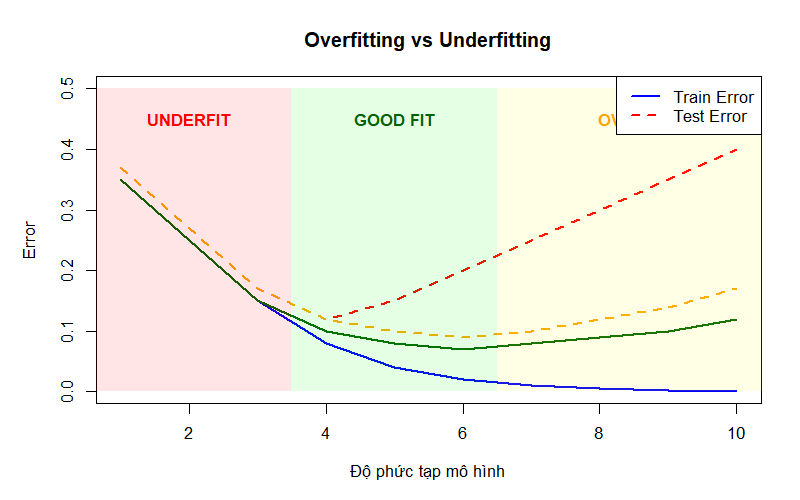
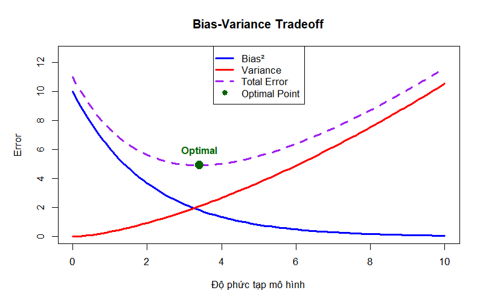

# BÀI 1: GIỚI THIỆU TỔNG QUAN VỀ HỌC MÁY (MACHINE LEARNING)

## Mục tiêu học tập
- Hiểu khái niệm Machine Learning và vai trò trong Data Science
- Phân biệt các loại Machine Learning  
- Nắm vững quy trình 10 bước xây dựng mô hình ML
- Hiểu overfitting, underfitting và cách khắc phục
- Có cái nhìn tổng quan trước khi học chi tiết

---

## 1.1 Machine Learning là gì?

### 1.1.1 Định nghĩa

**Machine Learning (Học máy)** là khả năng máy tính **học từ dữ liệu** để đưa ra dự đoán hoặc quyết định mà không cần lập trình rõ ràng.

**Định nghĩa của Arthur Samuel (1959):**
> "Machine Learning là lĩnh vực nghiên cứu giúp máy tính có khả năng học mà không cần được lập trình một cách tường minh."

**Định nghĩa của Tom Mitchell (1997):**
> "Một chương trình máy tính được cho là học từ kinh nghiệm **E** đối với một số lớp nhiệm vụ **T** và thước đo hiệu suất **P**, nếu hiệu suất của nó trong nhiệm vụ **T**, được đo bằng **P**, cải thiện với kinh nghiệm **E**."

### 1.1.2 So sánh với lập trình truyền thống

**Bảng so sánh:**

| Khía cạnh | Lập trình truyền thống | Machine Learning |
|-----------|------------------------|------------------|
| **Input** | Dữ liệu + **Quy tắc (code)** | Dữ liệu + **Kết quả** |
| **Output** | Kết quả | **Quy tắc (Mô hình)** |
| **Cách tiếp cận** | Lập trình viên viết logic | Máy tự học từ dữ liệu |
| **Thay đổi** | Sửa code | Cung cấp thêm dữ liệu |
| **Phù hợp** | Quy tắc rõ ràng | Quy tắc phức tạp, nhiều biến số |

**Ví dụ: Phát hiện chó trong ảnh**

- **Lập trình truyền thống**: Lập trình viên viết rule: "IF có 4 chân AND có đuôi AND có lông..."  
  ❌ Khó: Không bao quát được mọi trường hợp

- **Machine Learning**: Cho máy xem 10,000 ảnh chó + 10,000 ảnh khác  
  ✅ Máy tự học patterns, xử lý tốt mọi góc độ, ánh sáng

---

## 1.2 Các loại Machine Learning

### Bảng tổng quan

| Loại | Dữ liệu | Mục tiêu | Ví dụ |
|------|---------|----------|-------|
| **Supervised** | Có nhãn (X, y) | Dự đoán y từ X | Dự đoán giá nhà, Phát hiện spam |
| **Unsupervised** | Không nhãn (X) | Tìm cấu trúc | Phân nhóm khách hàng |
| **Reinforcement** | Hành động → Reward | Tối ưu hành động | Game AI, Robot |

### 1.2.1 Supervised Learning (Học có giám sát)

**Regression (Hồi quy) - Dự đoán số liên tục**

| Bài toán | Features (X) | Target (y) |
|----------|--------------|------------|
| Giá nhà | Diện tích, phòng, vị trí | 5 tỷ VNĐ |
| Doanh thu | Chi phí quảng cáo, mùa | 100 triệu |
| Điểm thi | Giờ học, điểm cũ | 8.5 điểm |

**Ví dụ minh họa:**



*Hình 1: Dự đoán giá nhà dựa trên diện tích - Ví dụ về Regression*

**Classification (Phân loại) - Dự đoán nhãn rời rạc**

| Bài toán | Features (X) | Target (y) | Loại |
|----------|--------------|------------|------|
| Email spam | Nội dung, người gửi | Spam/Ham | Binary |
| Chẩn đoán bệnh | Triệu chứng, xét nghiệm | A/B/C/Khỏe | Multi-class |
| Nhận dạng số | Pixels ảnh | 0-9 | 10 classes |

**Ví dụ minh họa:**



*Hình 2: Phân loại hoa Iris - Ví dụ về Classification với decision boundary*

### 1.2.2 Unsupervised Learning (Học không giám sát)

**Clustering (Phân cụm)**

Ví dụ: Phân nhóm khách hàng theo tuổi & thu nhập

```
Không có nhãn trước → Máy tự tìm 3 nhóm:
- Nhóm 1: Trẻ, thu nhập thấp  
- Nhóm 2: Trung niên, thu nhập cao
- Nhóm 3: Cao tuổi, thu nhập trung bình
```

**Ví dụ minh họa:**



*Hình 3: Phân cụm khách hàng thành 3 nhóm tự động*

**Dimensionality Reduction (Giảm chiều)**

```
100 features → 10 features chính
→ Giữ được 95% thông tin
→ Training nhanh hơn, dễ visualize
```

---

## 1.3 Quy trình 10 bước xây dựng mô hình ML

### Sơ đồ tổng quan

```
┌─────────────────────────────────────────────────────────┐
│                  QUY TRÌNH 10 BƯỚC                      │
├─────────────────────────────────────────────────────────┤
│                                                         │
│  1. Problem Understanding    ┐                          │
│  2. Data Understanding        ├─ Business Understanding │
│  3. Feature Understanding    ┘                          │
│                                                         │
│  4. Feature Engineering      ┐                          │
│  5. Dataset Partition         ├─ Data Preparation       │
│  6. Data Modelling           ┘                          │
│                                                         │
│  7. Data Evaluation          ┐                          │
│  8. Hyper-parameter Tuning    ├─ Model Optimization     │
│  9. Build Pipeline           ┘                          │
│                                                         │
│  10. Conclusion                                         │
│                                                         │
└─────────────────────────────────────────────────────────┘
```

### Step 1: Problem Understanding

**Xác định bài toán:**
- Loại: Regression? Classification? Clustering?
- Features: Những gì ta có
- Target: Muốn dự đoán gì
- Metric: Accuracy? RMSE? F1?

**Ví dụ:**

| Câu hỏi | Trả lời |
|---------|---------|
| Loại bài toán? | Binary Classification |
| Features? | Thời gian dùng, khiếu nại, giá |
| Target? | Churn (Yes/No) |
| Metric? | F1-score |

### Step 2: Data Understanding

**Kiểm tra 5 vấn đề:**

| Vấn đề | Ví dụ | Nguy hiểm |
|--------|-------|-----------|
| **Missing** | 20% thiếu "Thu nhập" | > 30% |
| **Outliers** | Giá = 1 tỷ khi TB 5 tỷ | Ảnh hưởng lớn |
| **Inconsistent** | Cùng địa chỉ, giá chênh 50% | Cần clean |
| **Imbalanced** | 99% Normal, 1% Fraud | Cần resample |
| **Skewness** | Thu nhập lệch phải | Cần transform |

### Step 3: Feature Understanding (EDA)

Phân tích:
1. **Univariate** (1 biến): Histogram, Stats
2. **Bivariate** (2 biến): Scatter, Correlation  
3. **Multivariate** (Nhiều biến): Heatmap

### Step 4: Feature Engineering

**6 kỹ thuật chính:**

**1. Missing/Outlier Handling**
- Mean/Median Imputation
- Drop nếu > 30%
- IQR method

**2. Feature Transformation**
- Log: Thu nhập lệch → log(thu nhập)
- Square root: Giảm outliers

**3. Feature Enrichment**
```
Gốc: Diện tích=80m², Giá=4tỷ
Mới: Giá/m² = 50 triệu/m²
```

**4. Feature Selection**
- Filter: Correlation
- Wrapper: Forward/Backward
- Embedded: Lasso, Tree importance

**5. Feature Encoding**

| Loại | Trước | Sau | Dùng khi |
|------|-------|-----|----------|
| Label | Red, Green, Blue | 0, 1, 2 | Có thứ tự |
| One-Hot | Red, Green, Blue | [1,0,0], [0,1,0], [0,0,1] | Không thứ tự |

**6. Feature Scaling**



*Hình 4: So sánh các phương pháp scaling - Original, Normalization, Standardization*

| Phương pháp | Công thức | Kết quả | Dùng cho |
|-------------|-----------|---------|----------|
| Normalization | (x-min)/(max-min) | [0, 1] | Neural Networks, KNN |
| Standardization | (x-mean)/std | Mean=0, SD=1 | Linear, SVM, PCA |

### Step 5: Dataset Partition

**Train/Validation/Test Split**



*Hình 5: Chia dữ liệu thành Train (70%), Validation (15%), Test (15%)*

```
TOÀN BỘ (100%)
├─ TRAIN (70%): Để học
├─ VALIDATION (15%): Tune hyperparameters  
└─ TEST (15%): Đánh giá cuối (chỉ dùng 1 lần!)
```

**Imbalanced Data:**

```
Vấn đề: 99% Normal, 1% Fraud
→ Model dự đoán tất cả "Normal" → 99% accuracy!
   Nhưng KHÔNG bắt được fraud!

Giải pháp:
- Oversampling: SMOTE
- Undersampling  
- Đổi metric: F1 thay vì Accuracy
```

### Step 6: Data Modelling

**So sánh thuật toán:**

| Bài toán | Đơn giản | Trung bình | Nâng cao |
|----------|----------|------------|----------|
| **Regression** | Linear Regression | Decision Tree | Random Forest, XGBoost |
| **Classification** | Logistic Regression | KNN, SVM | Random Forest, Neural Networks |
| **Clustering** | K-Means | Hierarchical | DBSCAN |

**Chiến lược:** Bắt đầu đơn giản → Tăng dần độ phức tạp



*Hình 6: So sánh accuracy của các thuật toán ML*

### Step 7: Data Evaluation

**Classification Metrics:**


*Hình 7: Confusion Matrix - TP, TN, FP, FN*

```
Accuracy  = (TP+TN) / Total
Precision = TP / (TP+FP)  ← Dự đoán Pos, bao nhiêu đúng?
Recall    = TP / (TP+FN)  ← Thực tế Pos, bắt được bao nhiêu?
F1-Score  = 2×(P×R)/(P+R)
```

**Regression Metrics:**

| Metric | Công thức | Ý nghĩa |
|--------|-----------|---------|
| MAE | mean(\|y-ŷ\|) | Sai số trung bình |
| RMSE | sqrt(mean((y-ŷ)²)) | Phạt nặng sai số lớn |
| R² | 1 - SS_res/SS_tot | % variance giải thích |

### Step 8: Hyper-parameter Tuning

**Cross-Validation (K=5)**



*Hình 8: 5-Fold Cross Validation - Train 5 lần, mỗi lần test trên fold khác*

**Grid Search:**
- Thử TẤT CẢ combinations
- Ví dụ: 3 params × 3 values = 27 thử nghiệm

**Regularization:**
- L1 (Lasso): Feature selection tự động
- L2 (Ridge): Giảm weights, tránh overfit

### Step 9: Build Pipeline

```
Raw Data
  ↓
Preprocessing (Missing, Outliers)
  ↓  
Feature Engineering (Encoding, Scaling)
  ↓
Model (Best model + Best params)
  ↓
Prediction
```

Lợi ích: Tự động hóa, tái sử dụng, dễ deploy

### Step 10: Conclusion

**Checklist:**
- ☑ Performance đạt yêu cầu?
- ☑ Không overfitting?
- ☑ Có ý nghĩa business?
- ☑ Ready to deploy?

---

## 1.4 Overfitting và Underfitting

### Khái niệm và minh họa



*Hình 9: So sánh Train Error và Test Error - Phát hiện Overfitting/Underfitting*

### So sánh

```
UNDERFITTING (Quá đơn giản)
Train Error: HIGH ↑    Test Error: HIGH ↑
→ Không học được patterns

GOOD FIT (Vừa phải)  
Train Error: LOW ↓     Test Error: LOW ↓
→ Học tốt, generalize tốt

OVERFITTING (Quá phức tạp)
Train Error: VERY LOW ↓↓   Test Error: HIGH ↑
→ Học quá kỹ, kể cả noise
```

### Bias-Variance Tradeoff



*Hình 10: Bias-Variance Tradeoff - Tìm điểm tối ưu*

### Cách phát hiện

```
So sánh Train vs Test:

Underfitting:  Train=60%, Test=58%  ← Cả 2 thấp
Good Fit:      Train=95%, Test=93%  ← Cả 2 cao, gần nhau  
Overfitting:   Train=99%, Test=75%  ← Chênh lệch LỚN!
```

### Cách khắc phục

| Vấn đề | Nguyên nhân | Giải pháp |
|--------|-------------|-----------|
| **Underfitting** | Mô hình quá đơn giản | • Dùng model phức tạp hơn<br>• Thêm features<br>• Giảm regularization |
| **Overfitting** | Mô hình quá phức tạp | • Thêm dữ liệu<br>• Regularization (L1/L2)<br>• Cross-validation<br>• Feature selection<br>• Early stopping |

---

## 1.5 Tóm tắt

### Các loại ML và ứng dụng

| Loại | Bài toán | Ví dụ | Thuật toán phổ biến |
|------|----------|-------|---------------------|
| **Supervised - Regression** | Dự đoán số | Giá nhà, Doanh thu | Linear Regression, Random Forest, XGBoost |
| **Supervised - Classification** | Dự đoán nhãn | Spam, Chẩn đoán bệnh | Logistic Regression, SVM, Neural Networks |
| **Unsupervised - Clustering** | Phân nhóm | Phân khúc khách hàng | K-Means, Hierarchical, DBSCAN |
| **Unsupervised - Reduction** | Giảm chiều | Visualize, Nén dữ liệu | PCA, t-SNE, UMAP |

### Quy trình ML (10 bước)

```
Business Understanding:
  1. Problem Understanding
  2. Data Understanding  
  3. Feature Understanding

Data Preparation:
  4. Feature Engineering
  5. Dataset Partition
  6. Data Modelling

Model Optimization:
  7. Data Evaluation
  8. Hyper-parameter Tuning
  9. Build Pipeline
  
  10. Conclusion
```

### Các khái niệm quan trọng

✅ **Supervised**: Học từ dữ liệu có nhãn (X, y)  
✅ **Unsupervised**: Tìm cấu trúc trong dữ liệu không nhãn  
✅ **Train/Test**: Tránh overfitting  
✅ **Cross-Validation**: Đánh giá chính xác  
✅ **Metrics**: Accuracy, F1, RMSE, R²  
✅ **Overfitting**: Train tốt, Test kém → Cần regularization

### Lưu ý quan trọng

⚠️ **LUÔN** chia train/test TRƯỚC khi train  
⚠️ **KHÔNG** dùng test set để tune  
⚠️ **KIỂM TRA** overfitting/underfitting  
⚠️ **CHỌN** metric phù hợp (F1 cho imbalanced)  
⚠️ **SỬ DỤNG** cross-validation

---

## BÀI TẬP

### Bài tập 1: Phân loại bài toán

Xác định loại bài toán ML cho các tình huống sau:

1. Dự đoán giá Bitcoin ngày mai
2. Phân nhóm khách hàng theo hành vi mua hàng
3. Phát hiện giao dịch gian lận
4. Nén ảnh từ 1000 features xuống 50 features
5. Dự đoán sinh viên có tốt nghiệp đúng hạn không

**Gợi ý:** Regression, Classification, Clustering, Dimensionality Reduction

### Bài tập 2: Chọn Metric

Chọn metric phù hợp cho các bài toán:

1. Dự đoán giá nhà (sai số 500 triệu là chấp nhận được)
2. Phát hiện ung thư (bỏ sót nguy hiểm!)
3. Dự đoán khách hàng rời bỏ (99% ở lại, 1% rời)
4. So sánh 2 mô hình phân loại 10 classes

**Gợi ý:** MAE, RMSE, Accuracy, Precision, Recall, F1

### Bài tập 3: Phát hiện Overfitting

Cho kết quả 3 models:

| Model | Train Accuracy | Test Accuracy |
|-------|----------------|---------------|
| A | 60% | 58% |
| B | 95% | 93% |
| C | 99% | 70% |

Hỏi: Model nào bị overfitting? Underfit? Good fit?

---

## BÀI TIẾP THEO

- **Bài 2**: Unsupervised Learning - Phân cụm (K-Means, Hierarchical, DBSCAN)
- **Bài 3**: Supervised Learning - Regression & Classification chi tiết
- **Bài 4**: Ensemble Methods (Bagging, Boosting, Stacking)
- **Bài 5**: Deep Learning cơ bản

---

**Cập nhật**: Tháng 3/2026
