Bài 2: Unsupervised Learning - Phân cụm (Clustering)
================
Giảng viên: Lê Nhật Tùng
Tháng 3, 2026

## Mục tiêu học tập

Sau khi hoàn thành bài học này, sinh viên có thể:

- Hiểu Unsupervised Learning và vai trò của Clustering
- Nắm vững thuật toán K-Means và cách hoạt động từng bước
- Biết cách chọn K tối ưu (Elbow Method và Silhouette Method)
- Hiểu và áp dụng Hierarchical Clustering
- Sử dụng DBSCAN cho dữ liệu phức tạp
- Đánh giá chất lượng clustering
- Áp dụng vào bài toán thực tế

------------------------------------------------------------------------

## 2.1 Unsupervised Learning là gì?

### 2.1.1 Định nghĩa

**Unsupervised Learning (Học không giám sát)** là học từ dữ liệu **KHÔNG
có nhãn**.

**Đặc điểm:**

- Chỉ có **input (X)**, không có output (y)
- Mục tiêu: Tìm **cấu trúc ẩn** trong dữ liệu
- Không có “đáp án đúng” để so sánh

### 2.1.2 So sánh với Supervised Learning

| Khía cạnh    | Supervised Learning           | Unsupervised Learning        |
|--------------|-------------------------------|------------------------------|
| **Dữ liệu**  | Có nhãn (X, y)                | Không nhãn (X)               |
| **Mục tiêu** | Dự đoán y từ X                | Tìm patterns, cấu trúc       |
| **Ví dụ**    | Phân loại spam, Dự đoán giá   | Phân nhóm khách hàng         |
| **Đánh giá** | Accuracy, F1, RMSE            | Silhouette, Elbow, Inertia   |
| **Độ khó**   | Dễ đánh giá (có ground truth) | Khó đánh giá (không có nhãn) |

### 2.1.3 Các loại Unsupervised Learning

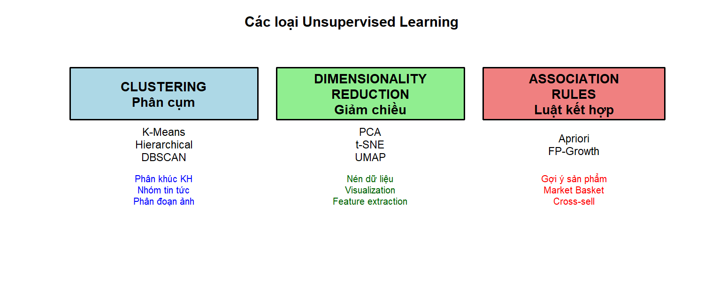<!-- -->

**1. Clustering (Phân cụm)**

- Nhóm các đối tượng tương tự vào cùng một cụm
- Thuật toán: K-Means, Hierarchical, DBSCAN
- Ứng dụng: Phân khúc khách hàng, nhóm tin tức

**2. Dimensionality Reduction (Giảm chiều)**

- Giảm số lượng features, giữ lại thông tin quan trọng
- Thuật toán: PCA, t-SNE, UMAP
- Ứng dụng: Visualization, nén dữ liệu, feature extraction

**3. Association Rules (Luật kết hợp)**

- Tìm mối quan hệ giữa các items
- Thuật toán: Apriori, FP-Growth
- Ứng dụng: Market Basket Analysis (mua bia thường mua tã)

**4. Anomaly Detection (Phát hiện bất thường)**

- Tìm các điểm dữ liệu khác biệt
- Ứng dụng: Phát hiện gian lận, lỗi hệ thống

------------------------------------------------------------------------

## 2.2 Clustering là gì?

### 2.2.1 Định nghĩa

**Clustering (Phân cụm)** là nhóm các đối tượng **tương tự** vào cùng
một cụm.

**Mục tiêu:**

- Các đối tượng **trong cùng cụm** có độ tương đồng cao
- Các đối tượng **khác cụm** có độ khác biệt cao

### 2.2.2 Ví dụ trực quan

``` r
set.seed(123)

# Tạo 3 nhóm dữ liệu rõ ràng
group1 <- data.frame(x = rnorm(50, 2, 0.5), y = rnorm(50, 2, 0.5))
group2 <- data.frame(x = rnorm(50, 8, 0.6), y = rnorm(50, 3, 0.6))
group3 <- data.frame(x = rnorm(50, 5, 0.5), y = rnorm(50, 7, 0.5))

all_data <- rbind(group1, group2, group3)
true_labels <- c(rep(1, 50), rep(2, 50), rep(3, 50))

par(mfrow = c(1, 2))

# Trước clustering
plot(all_data$x, all_data$y, pch = 19, col = "gray", cex = 1.2,
     xlab = "Feature 1", ylab = "Feature 2",
     main = "TRƯỚC clustering\n(Không có nhãn)")

# Sau clustering
plot(all_data$x, all_data$y, pch = 19, cex = 1.2,
     col = c("red", "blue", "green")[true_labels],
     xlab = "Feature 1", ylab = "Feature 2",
     main = "SAU clustering\n(Máy tự tìm 3 nhóm)")

legend("topright", legend = c("Cụm 1", "Cụm 2", "Cụm 3"),
       col = c("red", "blue", "green"), pch = 19, cex = 0.9)
```

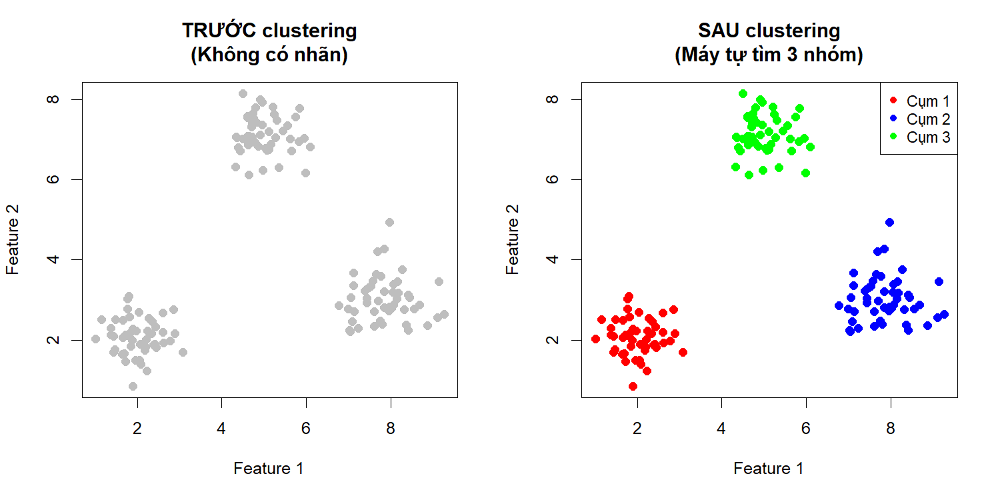<!-- -->

``` r
par(mfrow = c(1, 1))
```

### 2.2.3 Ứng dụng thực tế

| Lĩnh vực | Ứng dụng | Mục đích |
|----|----|----|
| **Marketing** | Phân khúc khách hàng | Chiến lược marketing riêng cho từng nhóm |
| **E-commerce** | Gợi ý sản phẩm | Tăng doanh thu, cross-sell |
| **Y tế** | Phân nhóm bệnh nhân | Điều trị cá nhân hóa |
| **Sinh học** | Phân loại gen | Nghiên cứu di truyền |
| **Xử lý ảnh** | Phân đoạn ảnh | Computer Vision, object detection |
| **Mạng xã hội** | Phát hiện cộng đồng | Phân tích mạng lưới |
| **Tài chính** | Phát hiện gian lận | Nhóm giao dịch bất thường |

**Ví dụ cụ thể: Phân khúc khách hàng**

``` r
set.seed(42)

# Tạo dữ liệu khách hàng
customers <- data.frame(
  Age = c(rnorm(70, 25, 4), rnorm(60, 45, 5), rnorm(70, 65, 6)),
  Income = c(rnorm(70, 30, 8), rnorm(60, 70, 10), rnorm(70, 45, 8)),
  Spending = c(rnorm(70, 20, 5), rnorm(60, 80, 12), rnorm(70, 40, 8))
)

# K-Means
km <- kmeans(customers, centers = 3, nstart = 25)
customers$Cluster <- km$cluster

# Visualization
par(mfrow = c(1, 2))

plot(customers$Age, customers$Income,
     col = c("red", "blue", "green")[customers$Cluster],
     pch = 19, cex = 1.3,
     xlab = "Tuổi", ylab = "Thu nhập (triệu/tháng)",
     main = "Age vs Income")
points(km$centers[, 1:2], pch = 4, cex = 3, lwd = 3)

plot(customers$Income, customers$Spending,
     col = c("red", "blue", "green")[customers$Cluster],
     pch = 19, cex = 1.3,
     xlab = "Thu nhập", ylab = "Chi tiêu",
     main = "Income vs Spending")
points(km$centers[, 2:3], pch = 4, cex = 3, lwd = 3)
```

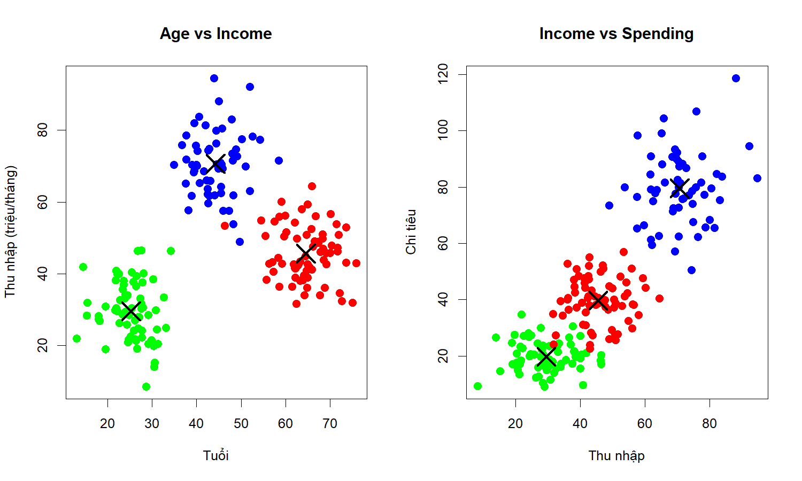<!-- -->

``` r
par(mfrow = c(1, 1))
```

**Phân tích 3 nhóm khách hàng:**

``` r
# Thống kê từng cụm
cluster_summary <- data.frame(
  Cum = 1:3,
  So_luong = as.numeric(table(customers$Cluster)),
  Tuoi_TB = tapply(customers$Age, customers$Cluster, mean),
  Thu_nhap_TB = tapply(customers$Income, customers$Cluster, mean),
  Chi_tieu_TB = tapply(customers$Spending, customers$Cluster, mean)
)

# Làm tròn
cluster_summary[, 3:5] <- round(cluster_summary[, 3:5], 1)

cluster_summary
```

    ##   Cum So_luong Tuoi_TB Thu_nhap_TB Chi_tieu_TB
    ## 1   1       71    64.6        45.6        39.7
    ## 2   2       59    44.3        70.7        79.6
    ## 3   3       70    25.2        29.5        19.8

**Đặc điểm và chiến lược:**

- **Cụm 1**: Trẻ, thu nhập thấp, chi tiêu thấp
  - Chiến lược: Sản phẩm giá rẻ, khuyến mãi mạnh
- **Cụm 2**: Trung niên, thu nhập cao, chi tiêu cao
  - Chiến lược: Sản phẩm cao cấp, chương trình VIP
- **Cụm 3**: Cao tuổi, thu nhập trung bình, chi tiêu vừa phải
  - Chiến lược: Sản phẩm chất lượng, dịch vụ tốt

------------------------------------------------------------------------

## 2.3 K-Means Clustering

### 2.3.1 Hiểu thuật toán K-Means từ đầu

**K-Means là gì?**

K-Means là thuật toán phân cụm dựa trên **khoảng cách**. Mục tiêu là
chia N điểm dữ liệu thành K cụm, sao cho:

- Các điểm **trong cùng cụm** gần nhau nhất (homogeneous)
- Các điểm **khác cụm** xa nhau nhất (well-separated)

**Tên gọi:**

- **K**: Số cụm (phải chọn trước)
- **Means**: Trung bình (centroid là điểm trung bình)

### 2.3.2 Các bước thuật toán chi tiết

**Bước 0: Chuẩn bị**

- Input: Dữ liệu X với N điểm, số cụm K
- Output: Gán nhãn cụm cho mỗi điểm

**Bước 1: Khởi tạo (Initialization)**

Chọn K centroids (tâm cụm) ban đầu. Có 3 cách phổ biến:

1.  **Random** - Chọn ngẫu nhiên K điểm làm centroids
2.  **K-Means++** - Chọn thông minh để centroids xa nhau
3.  **Random Partition** - Gán ngẫu nhiên, rồi tính centroids

``` r
set.seed(42)

# Tạo dữ liệu mẫu
data_points <- data.frame(
  x = c(rnorm(30, 2, 0.5), rnorm(30, 8, 0.6), rnorm(30, 5, 0.5)),
  y = c(rnorm(30, 2, 0.5), rnorm(30, 3, 0.6), rnorm(30, 7, 0.5))
)

par(mfrow = c(1, 3))

# Cách 1: Random
set.seed(123)
random_idx <- sample(1:nrow(data_points), 3)
plot(data_points$x, data_points$y, pch = 19, col = "gray", cex = 1.2,
     main = "Cách 1: Random\nChọn ngẫu nhiên 3 điểm",
     xlab = "X", ylab = "Y")
points(data_points$x[random_idx], data_points$y[random_idx], 
       pch = 8, cex = 3, lwd = 3, col = "red")
text(data_points$x[random_idx], data_points$y[random_idx] + 0.5, 
     labels = c("C1", "C2", "C3"), col = "red", font = 2)

# Cách 2: K-Means++ (mô phỏng - chọn xa nhau)
c1_idx <- sample(1:nrow(data_points), 1)
dist_to_c1 <- sqrt((data_points$x - data_points$x[c1_idx])^2 + 
                   (data_points$y - data_points$y[c1_idx])^2)
c2_idx <- which.max(dist_to_c1)
dist_to_c2 <- sqrt((data_points$x - data_points$x[c2_idx])^2 + 
                   (data_points$y - data_points$y[c2_idx])^2)
min_dist <- pmin(dist_to_c1, dist_to_c2)
c3_idx <- which.max(min_dist)
kmpp_idx <- c(c1_idx, c2_idx, c3_idx)

plot(data_points$x, data_points$y, pch = 19, col = "gray", cex = 1.2,
     main = "Cách 2: K-Means++\nChọn thông minh (xa nhau)",
     xlab = "X", ylab = "Y")
points(data_points$x[kmpp_idx], data_points$y[kmpp_idx], 
       pch = 8, cex = 3, lwd = 3, col = "blue")
text(data_points$x[kmpp_idx], data_points$y[kmpp_idx] + 0.5, 
     labels = c("C1", "C2", "C3"), col = "blue", font = 2)

# Cách 3: Random Partition
set.seed(456)
random_clusters <- sample(1:3, nrow(data_points), replace = TRUE)
centers_rp <- aggregate(data_points, by = list(random_clusters), mean)[, -1]

plot(data_points$x, data_points$y, pch = 19, col = "gray", cex = 1.2,
     main = "Cách 3: Random Partition\nGán ngẫu nhiên → Tính centroid",
     xlab = "X", ylab = "Y")
points(centers_rp$x, centers_rp$y, 
       pch = 8, cex = 3, lwd = 3, col = "green")
text(centers_rp$x, centers_rp$y + 0.5, 
     labels = c("C1", "C2", "C3"), col = "green", font = 2)
```

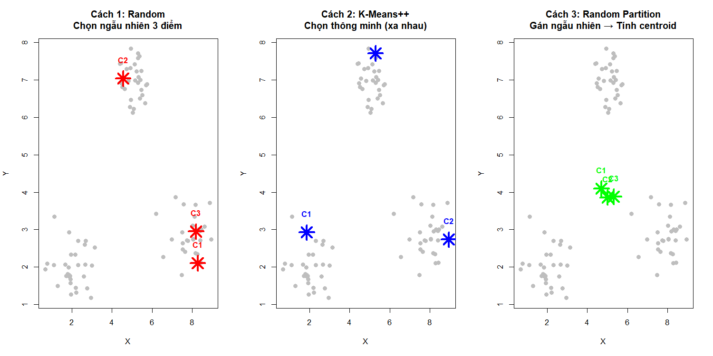<!-- -->

``` r
par(mfrow = c(1, 1))
```

**Bước 2: Assignment (Gán cụm)**

Với mỗi điểm, tính khoảng cách đến **tất cả K centroids**, gán vào cụm
**gần nhất**.

**Công thức khoảng cách Euclidean:**

``` math
d(x, c) = \sqrt{(x_1 - c_1)^2 + (x_2 - c_2)^2 + ... + (x_n - c_n)^2}
```

**Ví dụ tính khoảng cách:**

``` r
# Giả sử có 1 điểm và 3 centroids
point <- c(x = 5, y = 5)
centroid1 <- c(x = 2, y = 2)
centroid2 <- c(x = 8, y = 3)
centroid3 <- c(x = 5, y = 7)

# Tính khoảng cách
d1 <- sqrt(sum((point - centroid1)^2))
d2 <- sqrt(sum((point - centroid2)^2))
d3 <- sqrt(sum((point - centroid3)^2))

# Kết quả
data.frame(
  Centroid = c("C1", "C2", "C3"),
  Toa_do = c("(2, 2)", "(8, 3)", "(5, 7)"),
  Khoang_cach = round(c(d1, d2, d3), 2),
  Gan_cum = c(ifelse(d1 == min(c(d1, d2, d3)), "✓", ""),
              ifelse(d2 == min(c(d1, d2, d3)), "✓", ""),
              ifelse(d3 == min(c(d1, d2, d3)), "✓", ""))
)
```

    ##   Centroid Toa_do Khoang_cach Gan_cum
    ## 1       C1 (2, 2)        4.24        
    ## 2       C2 (8, 3)        3.61        
    ## 3       C3 (5, 7)        2.00       ✓

**Giải thích:** Điểm (5, 5) gần C3 nhất → Gán vào Cụm 3

**Minh họa Assignment:**

``` r
# Sử dụng K-Means++ centroids
km_init <- kmeans(data_points, centers = data_points[kmpp_idx, ], 
                  algorithm = "Lloyd", iter.max = 1)

par(mfrow = c(1, 2))

# Trước assignment
plot(data_points$x, data_points$y, pch = 19, col = "gray", cex = 1.5,
     main = "TRƯỚC Assignment\nCác điểm chưa có nhãn",
     xlab = "X", ylab = "Y")
points(data_points$x[kmpp_idx], data_points$y[kmpp_idx], 
       pch = 8, cex = 3, lwd = 3, col = "black")

# Sau assignment
plot(data_points$x, data_points$y, pch = 19, cex = 1.5,
     col = c("red", "blue", "green")[km_init$cluster],
     main = "SAU Assignment\nMỗi điểm gán vào cụm gần nhất",
     xlab = "X", ylab = "Y")
points(km_init$centers[, 1], km_init$centers[, 2], 
       pch = 4, cex = 3, lwd = 3, col = "black")
```

<!-- -->

``` r
par(mfrow = c(1, 1))
```

**Bước 3: Update (Cập nhật centroids)**

Với mỗi cụm, tính **centroid mới** = trung bình tọa độ của tất cả điểm
trong cụm.

**Công thức:**

``` math
\mu_k = \frac{1}{|C_k|} \sum_{x \in C_k} x
```

Trong đó $`|C_k|`$ là số điểm trong cụm k.

**Ví dụ tính centroid:**

``` r
# Giả sử Cụm 1 có 3 điểm
cluster1_points <- data.frame(
  x = c(2.1, 2.5, 1.8),
  y = c(2.3, 1.9, 2.1)
)

cluster1_points
```

    ##     x   y
    ## 1 2.1 2.3
    ## 2 2.5 1.9
    ## 3 1.8 2.1

``` r
# Tính centroid mới
new_centroid <- colMeans(cluster1_points)

data.frame(
  Thanh_phan = c("μ_x", "μ_y"),
  Cong_thuc = c("(2.1 + 2.5 + 1.8) / 3", "(2.3 + 1.9 + 2.1) / 3"),
  Ket_qua = round(new_centroid, 2)
)
```

    ##   Thanh_phan             Cong_thuc Ket_qua
    ## x        μ_x (2.1 + 2.5 + 1.8) / 3    2.13
    ## y        μ_y (2.3 + 1.9 + 2.1) / 3    2.10

**Minh họa Update:**

``` r
par(mfrow = c(1, 2))

# Trước update (centroids cũ)
plot(data_points$x, data_points$y, pch = 19, cex = 1.5,
     col = c("red", "blue", "green")[km_init$cluster],
     main = "TRƯỚC Update\nCentroids ở vị trí cũ",
     xlab = "X", ylab = "Y")
points(km_init$centers[, 1], km_init$centers[, 2], 
       pch = 8, cex = 3, lwd = 3, col = "black")

# Sau update (centroids mới)
km_update <- kmeans(data_points, centers = data_points[kmpp_idx, ], 
                    algorithm = "Lloyd", iter.max = 2)

plot(data_points$x, data_points$y, pch = 19, cex = 1.5,
     col = c("red", "blue", "green")[km_update$cluster],
     main = "SAU Update\nCentroids di chuyển về trung tâm",
     xlab = "X", ylab = "Y")
points(km_update$centers[, 1], km_update$centers[, 2], 
       pch = 4, cex = 3, lwd = 3, col = "black")

# Vẽ mũi tên di chuyển
arrows(km_init$centers[, 1], km_init$centers[, 2],
       km_update$centers[, 1], km_update$centers[, 2],
       col = "purple", lwd = 2, length = 0.15)
```

<!-- -->

``` r
par(mfrow = c(1, 1))
```

**Bước 4: Lặp lại**

Lặp lại Bước 2-3 cho đến khi:

- Centroids không đổi (hội tụ), HOẶC
- Đạt số iteration tối đa

### 2.3.3 Minh họa đầy đủ quá trình K-Means

``` r
set.seed(42)

# Chạy từng iteration
iterations <- list()
current_centers <- data_points[sample(1:nrow(data_points), 3), ]

for (iter in 1:6) {
  km_iter <- kmeans(data_points, centers = current_centers, 
                    algorithm = "Lloyd", iter.max = 1)
  iterations[[iter]] <- km_iter
  current_centers <- km_iter$centers
}

# Vẽ 6 iterations
par(mfrow = c(3, 2))

for (i in 1:6) {
  plot(data_points$x, data_points$y, pch = 19, cex = 1.3,
       col = c("red", "blue", "green")[iterations[[i]]$cluster],
       main = paste("Iteration", i, 
                    "\nWSS =", round(iterations[[i]]$tot.withinss, 1)),
       xlab = "X", ylab = "Y")
  points(iterations[[i]]$centers[, 1], iterations[[i]]$centers[, 2], 
         pch = 4, cex = 3, lwd = 3, col = "black")
  
  # Vẽ mũi tên di chuyển (trừ iteration 1)
  if (i > 1) {
    arrows(iterations[[i-1]]$centers[, 1], 
           iterations[[i-1]]$centers[, 2],
           iterations[[i]]$centers[, 1], 
           iterations[[i]]$centers[, 2],
           col = "purple", lwd = 1.5, length = 0.1)
  }
}
```

<!-- -->

``` r
par(mfrow = c(1, 1))
```

**Quá trình hội tụ:**

``` r
data.frame(
  Iteration = 1:6,
  WSS = sapply(iterations, function(x) round(x$tot.withinss, 2))
)
```

    ##   Iteration   WSS
    ## 1         1 48.57
    ## 2         2 48.57
    ## 3         3 48.57
    ## 4         4 48.57
    ## 5         5 48.57
    ## 6         6 48.57

**Nhận xét:** WSS giảm dần và ổn định → Thuật toán hội tụ

### 2.3.4 Hàm mục tiêu của K-Means

**Mục tiêu:** Tối thiểu hóa tổng khoảng cách bình phương trong cụm (WSS)

``` math
J = \sum_{k=1}^{K} \sum_{x \in C_k} ||x - \mu_k||^2
```

Trong đó:

- K: Số cụm
- $`C_k`$: Cụm thứ k
- $`\mu_k`$: Centroid của cụm k
- $`||x - \mu_k||^2`$: Khoảng cách Euclidean bình phương

**Minh họa hàm mục tiêu:**

``` r
km_final <- kmeans(data_points, centers = 3, nstart = 25)

plot(data_points$x, data_points$y, pch = 19, cex = 1.5,
     col = c("red", "blue", "green")[km_final$cluster],
     main = "Hàm mục tiêu: Tối thiểu hóa khoảng cách",
     xlab = "X", ylab = "Y")
points(km_final$centers[, 1], km_final$centers[, 2], 
       pch = 4, cex = 3, lwd = 3, col = "black")

# Vẽ khoảng cách từ 15 điểm ngẫu nhiên
set.seed(789)
sample_pts <- sample(1:nrow(data_points), 15)
for (i in sample_pts) {
  cluster <- km_final$cluster[i]
  segments(data_points$x[i], data_points$y[i],
           km_final$centers[cluster, 1],
           km_final$centers[cluster, 2],
           col = c("red", "blue", "green")[cluster],
           lty = 2, lwd = 1.5)
}
```

<!-- -->

**Tính toán WSS từng cụm:**

``` r
wss_by_cluster <- sapply(1:3, function(k) {
  cluster_points <- data_points[km_final$cluster == k, ]
  centroid <- km_final$centers[k, ]
  sum(rowSums((cluster_points - matrix(rep(centroid, each = nrow(cluster_points)), 
                                        ncol = 2))^2))
})

data.frame(
  Cum = 1:3,
  So_diem = as.numeric(table(km_final$cluster)),
  WSS = round(wss_by_cluster, 2)
)
```

    ##   Cum So_diem   WSS
    ## 1   1      30 10.47
    ## 2   2      30 19.13
    ## 3   3      30 18.98

**Tổng WSS:**

``` r
sum(wss_by_cluster)
```

    ## [1] 48.57225

### 2.3.5 Tại sao cần nstart = 25?

K-Means **nhạy cảm với khởi tạo**. Khởi tạo khác nhau → Kết quả khác
nhau!

``` r
set.seed(123)

par(mfrow = c(2, 3))

# Chạy 6 lần với seed khác nhau
wss_results <- numeric(6)

for (i in 1:6) {
  set.seed(i * 100)
  km_temp <- kmeans(data_points, centers = 3, nstart = 1)
  wss_results[i] <- km_temp$tot.withinss
  
  plot(data_points$x, data_points$y, pch = 19, cex = 1.2,
       col = c("red", "blue", "green")[km_temp$cluster],
       main = paste("Lần", i, "- WSS =", round(km_temp$tot.withinss, 0)),
       xlab = "X", ylab = "Y")
  points(km_temp$centers[, 1], km_temp$centers[, 2], 
         pch = 4, cex = 2.5, lwd = 2.5, col = "black")
}
```

<!-- -->

``` r
par(mfrow = c(1, 1))
```

**So sánh kết quả:**

``` r
# nstart = 1 (chạy 1 lần)
km_nstart1 <- kmeans(data_points, centers = 3, nstart = 1)

# nstart = 25 (chạy 25 lần, chọn tốt nhất)
km_nstart25 <- kmeans(data_points, centers = 3, nstart = 25)

data.frame(
  Phuong_phap = c("nstart = 1", "nstart = 25"),
  WSS = c(round(km_nstart1$tot.withinss, 2), 
          round(km_nstart25$tot.withinss, 2)),
  Ghi_chu = c("Có thể bị local minimum", "Chọn kết quả tốt nhất")
)
```

    ##   Phuong_phap   WSS                 Ghi_chu
    ## 1  nstart = 1 48.57 Có thể bị local minimum
    ## 2 nstart = 25 48.57   Chọn kết quả tốt nhất

**Kết luận:**

- `nstart = 1`: Chạy 1 lần → Có thể kém
- `nstart = 25`: Chạy 25 lần → Chọn WSS nhỏ nhất
- **Nên dùng `nstart = 25` hoặc cao hơn**

### 2.3.6 Ví dụ thực tế: Phân khúc khách hàng

``` r
set.seed(42)

# Dữ liệu khách hàng
customers <- data.frame(
  CustomerID = 1:200,
  Age = c(rnorm(70, 25, 4), rnorm(60, 45, 5), rnorm(70, 65, 6)),
  Income = c(rnorm(70, 30, 8), rnorm(60, 70, 10), rnorm(70, 45, 8)),
  Spending = c(rnorm(70, 20, 5), rnorm(60, 80, 12), rnorm(70, 40, 8))
)

# Xem dữ liệu mẫu
head(customers)
```

    ##   CustomerID      Age   Income Spending
    ## 1          1 30.48383 13.99257 26.67456
    ## 2          2 22.74121 32.67022 15.65364
    ## 3          3 26.45251 39.37060 20.27743
    ## 4          4 27.53145 46.47631 20.24533
    ## 5          5 26.61707 18.98511 17.10822
    ## 6          6 24.57550 20.79316 15.00631

**Thống kê mô tả:**

``` r
summary(customers[, 2:4])
```

    ##       Age            Income          Spending      
    ##  Min.   :13.03   Min.   : 8.401   Min.   :  9.056  
    ##  1st Qu.:27.61   1st Qu.:32.971   1st Qu.: 22.527  
    ##  Median :44.39   Median :43.345   Median : 38.743  
    ##  Mean   :44.84   Mean   :47.365   Mean   : 44.510  
    ##  3rd Qu.:62.18   3rd Qu.:61.945   3rd Qu.: 65.573  
    ##  Max.   :75.89   Max.   :94.596   Max.   :118.749

**K-Means clustering:**

``` r
# K-Means với K = 3
km_customers <- kmeans(customers[, 2:4], centers = 3, nstart = 25)

# Kích thước các cụm
table(km_customers$cluster)
```

    ## 
    ##  1  2  3 
    ## 71 59 70

``` r
# Centroids
round(km_customers$centers, 2)
```

    ##     Age Income Spending
    ## 1 64.64  45.56    39.72
    ## 2 44.28  70.70    79.63
    ## 3 25.22  29.53    19.77

**Visualization:**

``` r
customers$Cluster <- as.factor(km_customers$cluster)

par(mfrow = c(2, 2))

# Age vs Income
plot(customers$Age, customers$Income,
     col = c("red", "blue", "green")[customers$Cluster],
     pch = 19, cex = 1.2,
     xlab = "Tuổi", ylab = "Thu nhập (triệu/tháng)",
     main = "Age vs Income")
points(km_customers$centers[, 1:2], pch = 4, cex = 3, lwd = 3)
legend("topright", legend = paste("Cụm", 1:3),
       col = c("red", "blue", "green"), pch = 19, cex = 0.8)

# Age vs Spending
plot(customers$Age, customers$Spending,
     col = c("red", "blue", "green")[customers$Cluster],
     pch = 19, cex = 1.2,
     xlab = "Tuổi", ylab = "Chi tiêu (triệu/tháng)",
     main = "Age vs Spending")

# Income vs Spending
plot(customers$Income, customers$Spending,
     col = c("red", "blue", "green")[customers$Cluster],
     pch = 19, cex = 1.2,
     xlab = "Thu nhập", ylab = "Chi tiêu",
     main = "Income vs Spending")
points(km_customers$centers[, 2:3], pch = 4, cex = 3, lwd = 3)

# Cluster sizes
barplot(table(customers$Cluster), 
        names.arg = paste("Cụm", 1:3),
        col = c("red", "blue", "green"),
        main = "Kích thước các cụm",
        ylab = "Số khách hàng")
```

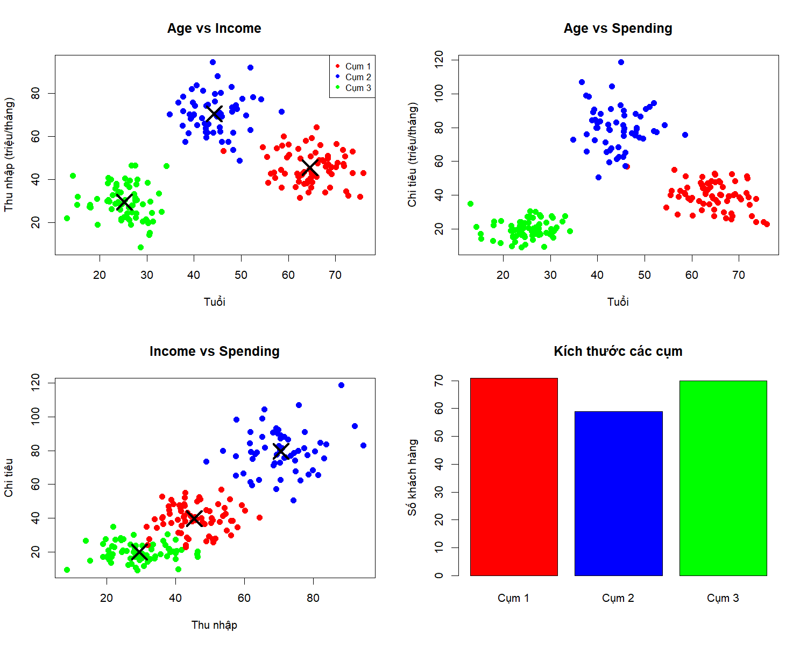<!-- -->

``` r
par(mfrow = c(1, 1))
```

**Phân tích từng cụm:**

``` r
cluster_summary <- data.frame(
  Cum = 1:3,
  So_luong = as.numeric(table(customers$Cluster)),
  Tuoi_TB = tapply(customers$Age, customers$Cluster, mean),
  Thu_nhap_TB = tapply(customers$Income, customers$Cluster, mean),
  Chi_tieu_TB = tapply(customers$Spending, customers$Cluster, mean)
)

cluster_summary[, 3:5] <- round(cluster_summary[, 3:5], 1)

cluster_summary
```

    ##   Cum So_luong Tuoi_TB Thu_nhap_TB Chi_tieu_TB
    ## 1   1       71    64.6        45.6        39.7
    ## 2   2       59    44.3        70.7        79.6
    ## 3   3       70    25.2        29.5        19.8

**Đặc điểm và chiến lược marketing:**

- **Cụm 1**: Trẻ (≈25 tuổi), thu nhập thấp, chi tiêu thấp
  - Chiến lược: Sản phẩm giá rẻ, khuyến mãi mạnh, marketing qua mạng xã
    hội
- **Cụm 2**: Trung niên (≈45 tuổi), thu nhập cao, chi tiêu cao
  - Chiến lược: Sản phẩm cao cấp, chương trình VIP, dịch vụ cá nhân hóa
- **Cụm 3**: Cao tuổi (≈65 tuổi), thu nhập trung bình, chi tiêu vừa phải
  - Chiến lược: Sản phẩm chất lượng bền vững, dịch vụ chu đáo

------------------------------------------------------------------------

## 2.4 Chọn số cụm K tối ưu

### 2.4.1 Vấn đề chọn K

**Câu hỏi lớn nhất trong K-Means**: Chọn K = bao nhiêu?

K-Means **BẮT BUỘC** phải biết K trước khi chạy. Trong thực tế: - Không
biết dữ liệu có bao nhiêu nhóm tự nhiên - Không có “đáp án đúng” (dữ
liệu không có nhãn) - K khác nhau → Kết quả hoàn toàn khác

**Minh họa: Cùng dữ liệu, khác K**

``` r
set.seed(42)

# Dữ liệu khách hàng
customers <- data.frame(
  Age = c(rnorm(70, 25, 4), rnorm(60, 45, 5), rnorm(70, 65, 6)),
  Income = c(rnorm(70, 30, 8), rnorm(60, 70, 10), rnorm(70, 45, 8))
)

par(mfrow = c(2, 3))

for (k in 2:7) {
  km <- kmeans(customers, centers = k, nstart = 25)
  plot(customers$Age, customers$Income,
       col = rainbow(k)[km$cluster],
       pch = 19, cex = 1.2,
       xlab = "Tuổi", ylab = "Thu nhập",
       main = paste("K =", k))
  points(km$centers, pch = 4, cex = 2.5, lwd = 2.5)
}
```

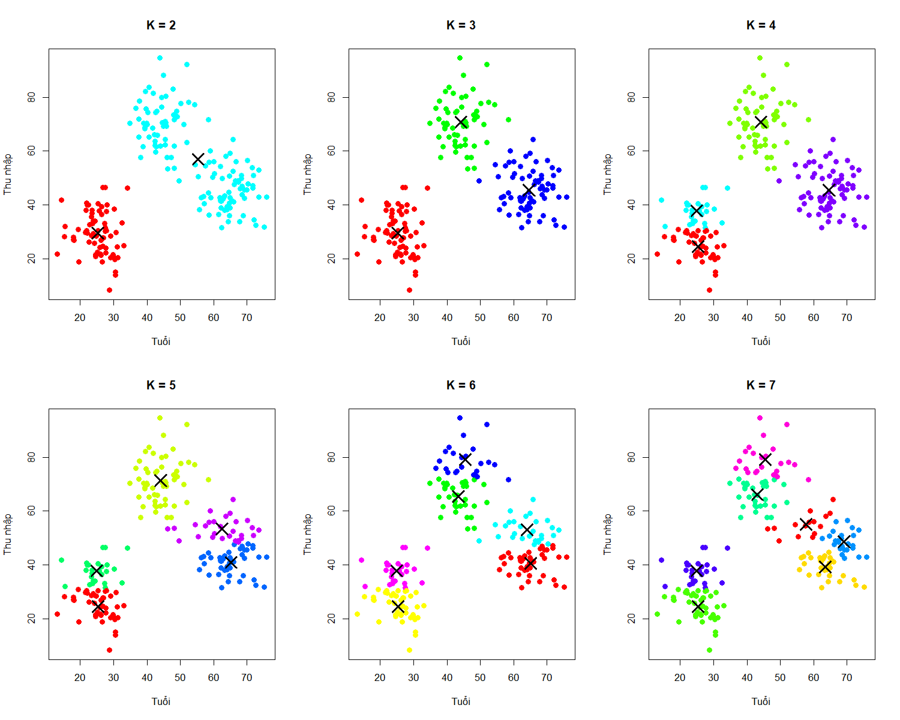<!-- -->

``` r
par(mfrow = c(1, 1))
```

**Nhận xét:**

- **K = 2**: Quá đơn giản, mất thông tin
- **K = 3**: Vừa phải, dễ hiểu
- **K = 7**: Quá phức tạp, khó giải thích

→ Cần phương pháp khoa học!

**Hậu quả chọn sai K:**

``` r
par(mfrow = c(1, 3))

# K quá nhỏ
km2 <- kmeans(customers, centers = 2, nstart = 25)
plot(customers$Age, customers$Income,
     col = c("red", "blue")[km2$cluster],
     pch = 19, cex = 1.3,
     main = "K=2: UNDERFITTING\nCụm không đồng nhất",
     xlab = "Tuổi", ylab = "Thu nhập")
points(km2$centers, pch = 4, cex = 3, lwd = 3)

# K vừa phải
km3 <- kmeans(customers, centers = 3, nstart = 25)
plot(customers$Age, customers$Income,
     col = c("red", "blue", "green")[km3$cluster],
     pch = 19, cex = 1.3,
     main = "K=3: GOOD FIT\nCụm rõ ràng",
     xlab = "Tuổi", ylab = "Thu nhập")
points(km3$centers, pch = 4, cex = 3, lwd = 3)

# K quá lớn
km7 <- kmeans(customers, centers = 7, nstart = 25)
plot(customers$Age, customers$Income,
     col = rainbow(7)[km7$cluster],
     pch = 19, cex = 1.3,
     main = "K=7: OVERFITTING\nQuá phức tạp",
     xlab = "Tuổi", ylab = "Thu nhập")
points(km7$centers, pch = 4, cex = 3, lwd = 3)
```

<!-- -->

``` r
par(mfrow = c(1, 1))
```

### 2.4.2 Elbow Method

**Ý tưởng:** Vẽ WSS theo K, tìm điểm “khuỷu tay”.

**WSS (Within-cluster Sum of Squares):**

``` math
WSS = \sum_{k=1}^{K} \sum_{x \in C_k} ||x - \mu_k||^2
```

- Tổng khoảng cách bình phương từ điểm đến centroid
- WSS giảm khi K tăng
- Tìm điểm WSS giảm chậm lại

**Ví dụ tính WSS:**

``` r
# Dữ liệu nhỏ
small_data <- data.frame(
  x = c(1, 2, 2, 8, 9, 9),
  y = c(1, 1, 2, 8, 8, 9)
)

small_data
```

    ##   x y
    ## 1 1 1
    ## 2 2 1
    ## 3 2 2
    ## 4 8 8
    ## 5 9 8
    ## 6 9 9

``` r
# K = 2
km_small <- kmeans(small_data, centers = 2, nstart = 25)

# Clusters
km_small$cluster
```

    ## [1] 1 1 1 2 2 2

``` r
# Centroids
km_small$centers
```

    ##          x        y
    ## 1 1.666667 1.333333
    ## 2 8.666667 8.333333

``` r
# WSS
km_small$tot.withinss
```

    ## [1] 2.666667

**Giải thích:** Cụm 1 gồm điểm 1,2,3 (gần nhau), Cụm 2 gồm điểm 4,5,6
(gần nhau) → WSS thấp

**Triển khai Elbow Method:**

``` r
# Tính WSS cho K = 1 đến 10
wss_values <- sapply(1:10, function(k) {
  kmeans(customers, centers = k, nstart = 25)$tot.withinss
})

# Vẽ biểu đồ
plot(1:10, wss_values, 
     type = "b", pch = 19, col = "blue", lwd = 2, cex = 1.5,
     xlab = "Số cụm K", ylab = "WSS",
     main = "Elbow Method")

grid()

# Đánh dấu elbow
points(3, wss_values[3], col = "red", pch = 19, cex = 3)
text(3, wss_values[3] + 2000, "Elbow\nK = 3", col = "red", font = 2)

# Giá trị WSS
text(1:10, wss_values + 1500, round(wss_values, 0), cex = 0.8, col = "darkblue")
```

<!-- -->

**Bảng phân tích:**

``` r
data.frame(
  K = 1:10,
  WSS = round(wss_values, 0),
  Giam = c(NA, round(-diff(wss_values), 0)),
  Giam_pct = c(NA, round(-diff(wss_values)/wss_values[-10]*100, 1))
)
```

    ##     K    WSS  Giam Giam_pct
    ## 1   1 127176    NA       NA
    ## 2   2  51456 75720     59.5
    ## 3   3  17362 34094     66.3
    ## 4   4  14485  2877     16.6
    ## 5   5  11725  2759     19.1
    ## 6   6   9108  2617     22.3
    ## 7   7   8030  1078     11.8
    ## 8   8   6987  1043     13.0
    ## 9   9   5998   989     14.2
    ## 10 10   5388   610     10.2

**Nhận xét:**

- K=1→2: WSS giảm mạnh
- K=2→3: WSS giảm mạnh  
- K=3→4: WSS giảm chậm lại ← **ELBOW**
- K\>3: WSS giảm ít

→ **Chọn K = 3**

**Giải thích Elbow:**

``` r
par(mfrow = c(1, 2))

# WSS
plot(1:10, wss_values, type = "b", pch = 19, col = "blue", lwd = 2,
     xlab = "K", ylab = "WSS", main = "Tại sao gọi là 'Elbow'?")
points(3, wss_values[3], col = "red", pch = 19, cex = 3)

# % giảm
pct_decrease <- c(NA, -diff(wss_values)/wss_values[-10]*100)
plot(2:10, pct_decrease[-1], type = "b", pch = 19, col = "darkgreen", lwd = 2,
     xlab = "K", ylab = "% Giảm WSS", main = "Tốc độ giảm WSS")
abline(h = 10, col = "red", lty = 2)
```

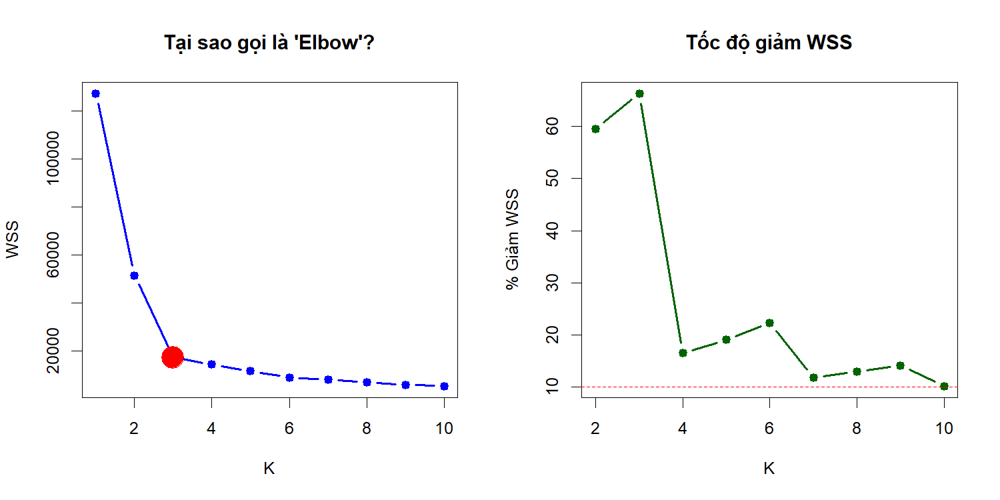<!-- -->

``` r
par(mfrow = c(1, 1))
```

**Cách nhận biết Elbow:**

- **Trước elbow**: WSS giảm nhanh → Mỗi cụm mang lại giá trị lớn
- **Sau elbow**: WSS giảm chậm → Thêm cụm không mang lại nhiều giá trị

→ K tại elbow = cân bằng độ chính xác và độ đơn giản

**Hạn chế:**

``` r
# Dữ liệu khó xác định elbow
set.seed(123)
difficult <- data.frame(x = rnorm(200, 5, 3), y = rnorm(200, 5, 3))
wss_diff <- sapply(1:10, function(k) {
  kmeans(difficult, centers = k, nstart = 25)$tot.withinss
})

par(mfrow = c(1, 2))

plot(1:10, wss_values, type = "b", pch = 19, col = "blue", lwd = 2,
     main = "Elbow RÕ RÀNG", xlab = "K", ylab = "WSS")
points(3, wss_values[3], col = "red", pch = 19, cex = 2)

plot(1:10, wss_diff, type = "b", pch = 19, col = "blue", lwd = 2,
     main = "Elbow KHÔNG RÕ", xlab = "K", ylab = "WSS")
```

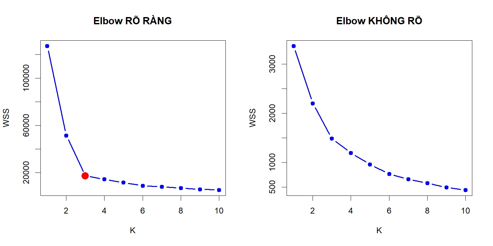<!-- -->

``` r
par(mfrow = c(1, 1))
```

**Kết luận Elbow Method:**

- ✅ Đơn giản, trực quan
- ❌ Elbow không phải lúc nào cũng rõ
- ❌ Phụ thuộc cảm nhận chủ quan

### 2.4.3 Silhouette Method

**Ý tưởng:** Đo độ phù hợp của mỗi điểm với cụm của nó.

**Silhouette Score s(i):**

``` math
s(i) = \frac{b(i) - a(i)}{\max(a(i), b(i))}
```

- **a(i)**: KC trung bình đến các điểm trong cùng cụm (càng nhỏ càng
  tốt)
- **b(i)**: KC trung bình đến cụm gần nhất khác (càng lớn càng tốt)

**Ví dụ minh họa:**

``` r
# Dữ liệu đơn giản
example <- data.frame(
  x = c(2, 2.5, 2.2,  8, 8.5, 8.3),
  y = c(2, 2.3, 1.8,  8, 8.2, 7.9)
)
ex_clusters <- c(1, 1, 1, 2, 2, 2)

plot(example$x, example$y,
     col = c("red", "blue")[ex_clusters],
     pch = 19, cex = 3,
     main = "Tính Silhouette cho điểm i",
     xlab = "X", ylab = "Y", xlim = c(0, 10), ylim = c(0, 10))

# Điểm i
i <- 1
points(example$x[i], example$y[i], pch = 1, cex = 4, lwd = 3)
text(example$x[i], example$y[i] - 0.7, "i", font = 2, cex = 1.5)

# KC đến cùng cụm (a)
for (j in which(ex_clusters == 1 & (1:6) != i)) {
  segments(example$x[i], example$y[i], example$x[j], example$y[j],
           col = "red", lwd = 2)
}

# KC đến cụm khác (b)
for (j in which(ex_clusters == 2)) {
  segments(example$x[i], example$y[i], example$x[j], example$y[j],
           col = "blue", lwd = 2, lty = 2)
}

text(2.5, 3, "a(i)", col = "red", font = 2)
text(5, 5, "b(i)", col = "blue", font = 2)
```

<!-- -->

**Tính toán:**

``` r
i <- 1
same <- which(ex_clusters == 1 & (1:6) != i)
other <- which(ex_clusters == 2)

a_i <- mean(sqrt((example$x[i] - example$x[same])^2 + 
                 (example$y[i] - example$y[same])^2))
b_i <- mean(sqrt((example$x[i] - example$x[other])^2 + 
                 (example$y[i] - example$y[other])^2))
s_i <- (b_i - a_i) / max(a_i, b_i)

data.frame(
  a_i = round(a_i, 2),
  b_i = round(b_i, 2),
  s_i = round(s_i, 3)
)
```

    ##    a_i b_i  s_i
    ## 1 0.43 8.7 0.95

**Ý nghĩa giá trị:**

| Giá trị            | Ý nghĩa           |
|--------------------|-------------------|
| s(i) \> 0.7        | Rất phù hợp       |
| 0.5 \< s(i) ≤ 0.7  | Phù hợp           |
| 0.25 \< s(i) ≤ 0.5 | Trung bình        |
| s(i) \< 0.25       | Có thể bị gán sai |

**Triển khai:**

``` r
library(cluster)

# Tính Silhouette cho K = 2 đến 10
sil_scores <- sapply(2:10, function(k) {
  km <- kmeans(customers, centers = k, nstart = 25)
  sil <- silhouette(km$cluster, dist(customers))
  mean(sil[, 3])
})

# Vẽ biểu đồ
plot(2:10, sil_scores, 
     type = "b", pch = 19, col = "blue", lwd = 2, cex = 1.5,
     xlab = "K", ylab = "Silhouette Score",
     main = "Silhouette Method", ylim = c(0, max(sil_scores) + 0.1))

grid()

# Best K
best_k <- which.max(sil_scores) + 1
points(best_k, max(sil_scores), col = "red", pch = 19, cex = 3)
text(best_k, max(sil_scores) + 0.06, paste("Best K =", best_k), 
     col = "red", font = 2)

# Ngưỡng
abline(h = 0.7, col = "darkgreen", lty = 2)
abline(h = 0.5, col = "orange", lty = 2)
abline(h = 0.3, col = "red", lty = 2)

text(9, 0.75, ">0.7: Rất tốt", col = "darkgreen", cex = 0.9)
text(9, 0.55, "0.5-0.7: Tốt", col = "orange", cex = 0.9)
text(9, 0.35, "0.3-0.5: TB", col = "red", cex = 0.9)
```

<!-- -->

**Bảng kết quả:**

``` r
data.frame(
  K = 2:10,
  Silhouette = round(sil_scores, 4),
  Danh_gia = ifelse(sil_scores > 0.7, "Rất tốt",
              ifelse(sil_scores > 0.5, "Tốt", "Trung bình"))
)
```

    ##    K Silhouette   Danh_gia
    ## 1  2     0.5773        Tốt
    ## 2  3     0.6663        Tốt
    ## 3  4     0.5568        Tốt
    ## 4  5     0.4471 Trung bình
    ## 5  6     0.4005 Trung bình
    ## 6  7     0.4033 Trung bình
    ## 7  8     0.3983 Trung bình
    ## 8  9     0.3915 Trung bình
    ## 9 10     0.3962 Trung bình

**Silhouette Plot chi tiết cho K=3:**

``` r
km3 <- kmeans(customers, centers = 3, nstart = 25)
sil3 <- silhouette(km3$cluster, dist(customers))

plot(sil3, col = c("red", "blue", "green"),
     main = paste("Silhouette Plot (K=3)\nAvg =", round(mean(sil3[, 3]), 3)),
     border = NA)
```

<!-- -->

**Giải thích Silhouette Plot:**

- Chiều rộng: Silhouette score của từng điểm
- Đường đứt: Average score
- Cụm tốt: Hầu hết điểm \> average

### 2.4.4 So sánh 2 phương pháp

``` r
par(mfrow = c(1, 2))

# Elbow
plot(1:10, wss_values, type = "b", pch = 19, col = "blue", lwd = 2,
     main = "Elbow Method", xlab = "K", ylab = "WSS")
points(3, wss_values[3], col = "red", pch = 19, cex = 2)

# Silhouette
plot(2:10, sil_scores, type = "b", pch = 19, col = "blue", lwd = 2,
     main = "Silhouette Method", xlab = "K", ylab = "Score")
points(best_k, max(sil_scores), col = "red", pch = 19, cex = 2)
```

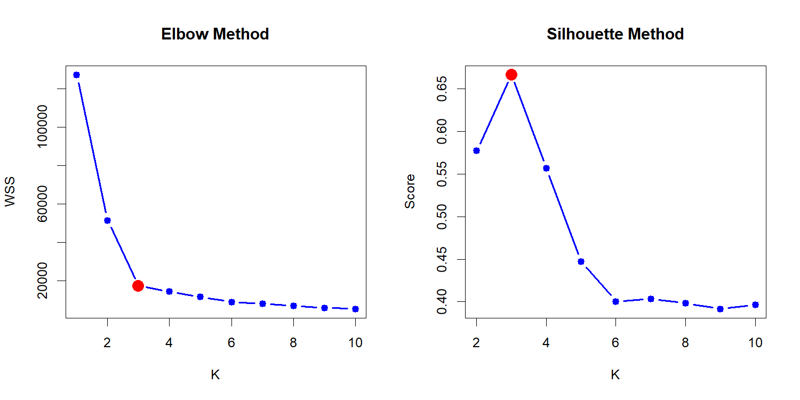<!-- -->

``` r
par(mfrow = c(1, 1))
```

**Kết luận:**

- **Elbow gợi ý**: K = 3
- **Silhouette gợi ý**: K = 3
- **Quyết định cuối**: K = 3 (2 phương pháp đồng ý)

------------------------------------------------------------------------

## 2.5 Hierarchical Clustering

### 2.5.1 Giới thiệu

**Hierarchical Clustering (Phân cụm phân cấp)** xây dựng cây phân cấp
của các cụm.

**Khác biệt với K-Means:**

- ✅ **KHÔNG cần** chọn K trước
- ✅ Tạo **dendrogram** (cây phân cấp)
- ✅ Cho phép xem cấu trúc phân cấp
- ❌ Chậm hơn K-Means với dữ liệu lớn

### 2.5.2 Hai loại Hierarchical Clustering

**1. Agglomerative (Bottom-up)**

- Bắt đầu: Mỗi điểm là 1 cụm
- Lặp: Gộp 2 cụm gần nhất
- Kết thúc: Tất cả thành 1 cụm lớn

**2. Divisive (Top-down)**

- Bắt đầu: Tất cả là 1 cụm
- Lặp: Chia cụm xa nhất
- Kết thúc: Mỗi điểm là 1 cụm

**Trong R chúng ta dùng Agglomerative** (phổ biến hơn)

### 2.5.3 Thuật toán Agglomerative

**Các bước:**

1.  Mỗi điểm là 1 cụm riêng (N cụm)
2.  Tính khoảng cách giữa TẤT CẢ cặp cụm
3.  Gộp 2 cụm gần nhất
4.  Lặp bước 2-3 cho đến khi còn 1 cụm

**Minh họa quá trình:**

``` r
set.seed(42)

# Dữ liệu nhỏ (6 điểm)
small_data <- data.frame(
  x = c(1, 2, 2, 8, 9, 9),
  y = c(1, 1, 2, 8, 8, 9),
  label = paste("P", 1:6, sep="")
)

par(mfrow = c(2, 3))

# Bước 0: Mỗi điểm là 1 cụm
plot(small_data$x, small_data$y, pch = 19, cex = 2,
     col = rainbow(6), xlim = c(0, 10), ylim = c(0, 10),
     xlab = "X", ylab = "Y",
     main = "Bước 0: 6 cụm\nMỗi điểm 1 cụm")
text(small_data$x, small_data$y + 0.5, small_data$label, font = 2)

# Bước 1: Gộp P1 và P2 (gần nhất)
colors1 <- c(1, 1, 2, 3, 4, 5)
plot(small_data$x, small_data$y, pch = 19, cex = 2,
     col = rainbow(5)[colors1], xlim = c(0, 10), ylim = c(0, 10),
     xlab = "X", ylab = "Y",
     main = "Bước 1: 5 cụm\nGộp P1, P2")
text(small_data$x, small_data$y + 0.5, small_data$label, font = 2)
lines(small_data$x[1:2], small_data$y[1:2], lwd = 2, col = rainbow(5)[1])

# Bước 2: Gộp {P1,P2} và P3
colors2 <- c(1, 1, 1, 2, 3, 4)
plot(small_data$x, small_data$y, pch = 19, cex = 2,
     col = rainbow(4)[colors2], xlim = c(0, 10), ylim = c(0, 10),
     xlab = "X", ylab = "Y",
     main = "Bước 2: 4 cụm\nGộp {P1,P2}, P3")
text(small_data$x, small_data$y + 0.5, small_data$label, font = 2)
lines(small_data$x[1:3], small_data$y[1:3], lwd = 2, col = rainbow(4)[1])

# Bước 3: Gộp P4 và P5
colors3 <- c(1, 1, 1, 2, 2, 3)
plot(small_data$x, small_data$y, pch = 19, cex = 2,
     col = rainbow(3)[colors3], xlim = c(0, 10), ylim = c(0, 10),
     xlab = "X", ylab = "Y",
     main = "Bước 3: 3 cụm\nGộp P4, P5")
text(small_data$x, small_data$y + 0.5, small_data$label, font = 2)
lines(small_data$x[1:3], small_data$y[1:3], lwd = 2, col = rainbow(3)[1])
lines(small_data$x[4:5], small_data$y[4:5], lwd = 2, col = rainbow(3)[2])

# Bước 4: Gộp {P4,P5} và P6
colors4 <- c(1, 1, 1, 2, 2, 2)
plot(small_data$x, small_data$y, pch = 19, cex = 2,
     col = rainbow(2)[colors4], xlim = c(0, 10), ylim = c(0, 10),
     xlab = "X", ylab = "Y",
     main = "Bước 4: 2 cụm\nGộp {P4,P5}, P6")
text(small_data$x, small_data$y + 0.5, small_data$label, font = 2)
lines(small_data$x[1:3], small_data$y[1:3], lwd = 2, col = rainbow(2)[1])
lines(small_data$x[4:6], small_data$y[4:6], lwd = 2, col = rainbow(2)[2])

# Bước 5: Gộp 2 cụm lớn
colors5 <- rep(1, 6)
plot(small_data$x, small_data$y, pch = 19, cex = 2,
     col = "purple", xlim = c(0, 10), ylim = c(0, 10),
     xlab = "X", ylab = "Y",
     main = "Bước 5: 1 cụm\nGộp hết")
text(small_data$x, small_data$y + 0.5, small_data$label, font = 2)
```

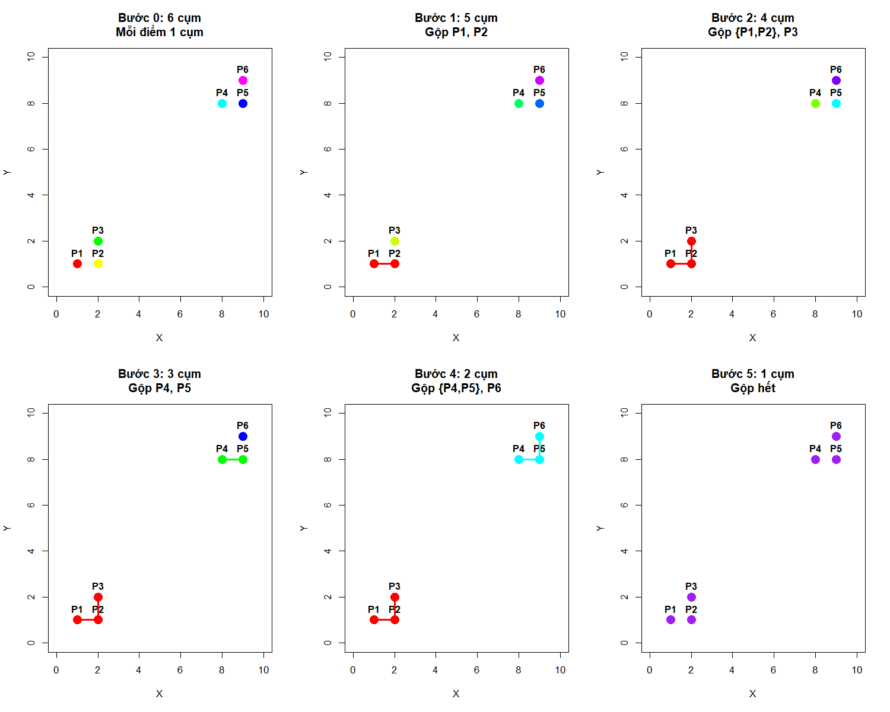<!-- -->

``` r
par(mfrow = c(1, 1))
```

### 2.5.4 Linkage Methods

**Câu hỏi quan trọng:** Tính khoảng cách giữa 2 **CỤM** như thế nào?

Có 4 phương pháp chính:

**1. Single Linkage (Min)**

- Khoảng cách = min khoảng cách giữa 2 điểm bất kỳ
- Công thức: $`d(A, B) = \min_{a \in A, b \in B} d(a, b)`$
- Đặc điểm: Tạo chuỗi dài, nhạy cảm với outliers

**2. Complete Linkage (Max)**

- Khoảng cách = max khoảng cách giữa 2 điểm
- Công thức: $`d(A, B) = \max_{a \in A, b \in B} d(a, b)`$
- Đặc điểm: Tạo cụm chặt, kích thước đồng đều

**3. Average Linkage**

- Khoảng cách = trung bình khoảng cách tất cả cặp điểm
- Công thức:
  $`d(A, B) = \frac{1}{|A||B|} \sum_{a \in A, b \in B} d(a, b)`$
- Đặc điểm: Cân bằng, phổ biến nhất

**4. Ward’s Method**

- Gộp 2 cụm làm tăng WSS (Within Sum of Squares) ít nhất
- Đặc điểm: Tạo cụm kích thước đều, tốt nhất trong nhiều TH

**Minh họa Linkage:**

``` r
par(mfrow = c(2, 2))

# Tạo 2 cụm mẫu
cluster_A <- data.frame(x = c(1, 2, 1.5), y = c(1, 1.5, 2))
cluster_B <- data.frame(x = c(8, 9, 8.5), y = c(8, 8.5, 9))

# Single Linkage
plot(c(cluster_A$x, cluster_B$x), c(cluster_A$y, cluster_B$y),
     col = c(rep("red", 3), rep("blue", 3)), pch = 19, cex = 2,
     xlab = "X", ylab = "Y", main = "Single Linkage\n(Min distance)")
# Vẽ khoảng cách min
min_dist <- which.min(dist(rbind(cluster_A, cluster_B)))
segments(cluster_A$x[1], cluster_A$y[1], 
         cluster_B$x[1], cluster_B$y[1],
         col = "green", lwd = 3)
text(5, 5, "MIN", col = "green", font = 2, cex = 1.5)

# Complete Linkage
plot(c(cluster_A$x, cluster_B$x), c(cluster_A$y, cluster_B$y),
     col = c(rep("red", 3), rep("blue", 3)), pch = 19, cex = 2,
     xlab = "X", ylab = "Y", main = "Complete Linkage\n(Max distance)")
# Vẽ khoảng cách max
segments(cluster_A$x[1], cluster_A$y[1], 
         cluster_B$x[3], cluster_B$y[3],
         col = "orange", lwd = 3)
text(5, 5, "MAX", col = "orange", font = 2, cex = 1.5)

# Average Linkage
plot(c(cluster_A$x, cluster_B$x), c(cluster_A$y, cluster_B$y),
     col = c(rep("red", 3), rep("blue", 3)), pch = 19, cex = 2,
     xlab = "X", ylab = "Y", main = "Average Linkage\n(Avg all pairs)")
# Vẽ tất cả khoảng cách
for(i in 1:3) {
  for(j in 1:3) {
    segments(cluster_A$x[i], cluster_A$y[i],
             cluster_B$x[j], cluster_B$y[j],
             col = "purple", lwd = 1, lty = 2)
  }
}
text(5, 5, "AVG", col = "purple", font = 2, cex = 1.5)

# Ward
plot(c(cluster_A$x, cluster_B$x), c(cluster_A$y, cluster_B$y),
     col = c(rep("red", 3), rep("blue", 3)), pch = 19, cex = 2,
     xlab = "X", ylab = "Y", main = "Ward's Method\n(Min increase WSS)")
# Vẽ centroids
points(mean(cluster_A$x), mean(cluster_A$y), pch = 4, cex = 3, lwd = 3)
points(mean(cluster_B$x), mean(cluster_B$y), pch = 4, cex = 3, lwd = 3)
text(5, 5, "WSS", col = "darkred", font = 2, cex = 1.5)
```

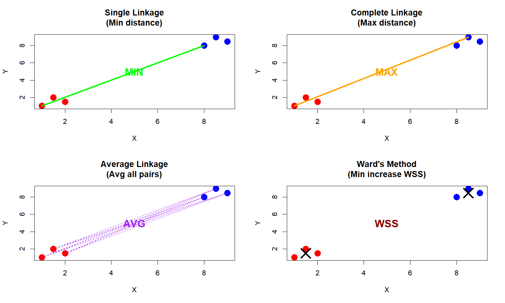<!-- -->

``` r
par(mfrow = c(1, 1))
```

### 2.5.5 Dendrogram (Cây phân cấp)

**Dendrogram** là biểu đồ cây thể hiện quá trình gộp cụm.

**Cách đọc Dendrogram:**

- **Trục Y**: Khoảng cách/độ tương đồng
- **Chiều cao**: Khoảng cách giữa 2 cụm khi gộp
- **Cắt ngang**: Chọn số cụm K

``` r
# Dùng dữ liệu customers từ trước
set.seed(42)
customers_hc <- data.frame(
  Age = c(rnorm(70, 25, 4), rnorm(60, 45, 5), rnorm(70, 65, 6)),
  Income = c(rnorm(70, 30, 8), rnorm(60, 70, 10), rnorm(70, 45, 8))
)

# Hierarchical clustering
dist_matrix <- dist(customers_hc)
hc_complete <- hclust(dist_matrix, method = "complete")
hc_average <- hclust(dist_matrix, method = "average")
hc_ward <- hclust(dist_matrix, method = "ward.D2")

par(mfrow = c(3, 1))

# Complete linkage
plot(hc_complete, main = "Dendrogram - Complete Linkage", 
     xlab = "", sub = "", labels = FALSE, hang = -1)
rect.hclust(hc_complete, k = 3, border = "red")
abline(h = 50, col = "blue", lty = 2, lwd = 2)
text(100, 53, "Cắt ở đây → K=3", col = "blue", font = 2)

# Average linkage
plot(hc_average, main = "Dendrogram - Average Linkage", 
     xlab = "", sub = "", labels = FALSE, hang = -1)
rect.hclust(hc_average, k = 3, border = "red")

# Ward
plot(hc_ward, main = "Dendrogram - Ward's Method", 
     xlab = "", sub = "", labels = FALSE, hang = -1)
rect.hclust(hc_ward, k = 3, border = "red")
```

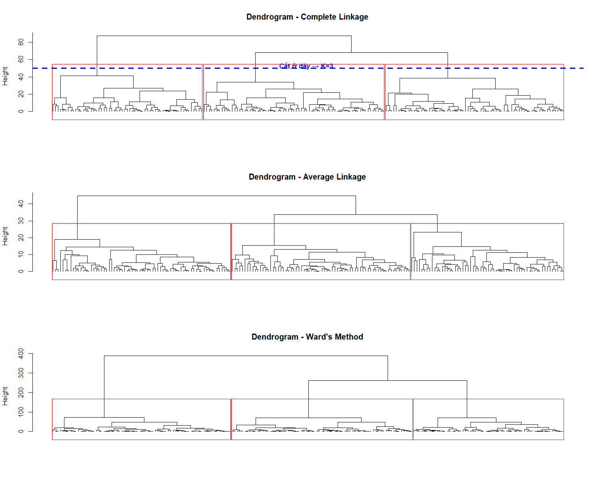<!-- -->

``` r
par(mfrow = c(1, 1))
```

**Giải thích:**

- Đường đỏ: Khung 3 cụm khi cắt
- Đường xanh: Vị trí cắt để được K=3
- Càng cắt thấp → càng nhiều cụm
- Càng cắt cao → càng ít cụm

### 2.5.6 Chọn số cụm K

**Cách 1: Quan sát Dendrogram**

Tìm khoảng cách lớn nhất giữa các lần gộp → cắt ở đó

**Cách 2: Elbow Method với WSS**

``` r
# Tính WSS cho mỗi K
wss_hc <- sapply(2:10, function(k) {
  clusters <- cutree(hc_ward, k = k)
  sum(sapply(1:k, function(i) {
    cluster_data <- customers_hc[clusters == i, ]
    if(nrow(cluster_data) > 1) {
      centroid <- colMeans(cluster_data)
      sum(rowSums((cluster_data - matrix(rep(centroid, each = nrow(cluster_data)), 
                                          ncol = 2))^2))
    } else {
      0
    }
  }))
})

plot(2:10, wss_hc, type = "b", pch = 19, col = "blue", lwd = 2, cex = 1.5,
     xlab = "Số cụm K", ylab = "WSS",
     main = "Elbow Method cho Hierarchical Clustering")
grid()
points(3, wss_hc[2], col = "red", pch = 19, cex = 3)
text(3, wss_hc[2] + 1000, "K = 3", col = "red", font = 2)
```

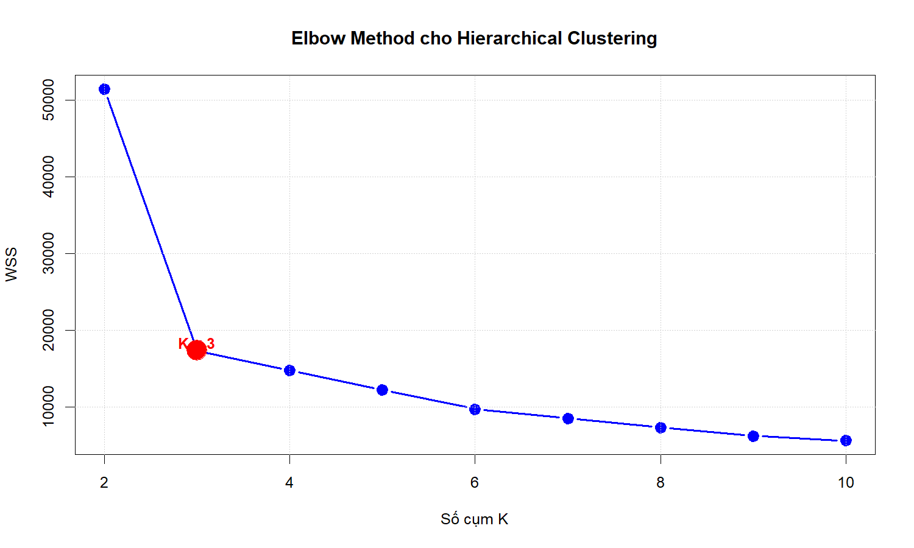<!-- -->

### 2.5.7 Triển khai hoàn chỉnh

``` r
# Chọn K = 3
clusters_hc <- cutree(hc_ward, k = 3)

par(mfrow = c(2, 2))

# Visualization
plot(customers_hc$Age, customers_hc$Income,
     col = c("red", "blue", "green")[clusters_hc],
     pch = 19, cex = 1.2,
     xlab = "Tuổi", ylab = "Thu nhập",
     main = "Hierarchical Clustering\n(Ward's Method, K=3)")

# So sánh với K-Means
km_compare <- kmeans(customers_hc, centers = 3, nstart = 25)
plot(customers_hc$Age, customers_hc$Income,
     col = c("red", "blue", "green")[km_compare$cluster],
     pch = 19, cex = 1.2,
     xlab = "Tuổi", ylab = "Thu nhập",
     main = "K-Means\n(K=3)")
points(km_compare$centers, pch = 4, cex = 3, lwd = 3)

# Dendrogram
plot(hc_ward, main = "Dendrogram", labels = FALSE, hang = -1)
rect.hclust(hc_ward, k = 3, border = "red")

# Cluster sizes
barplot(table(clusters_hc), 
        names.arg = paste("Cụm", 1:3),
        col = c("red", "blue", "green"),
        main = "Kích thước các cụm",
        ylab = "Số điểm")
```

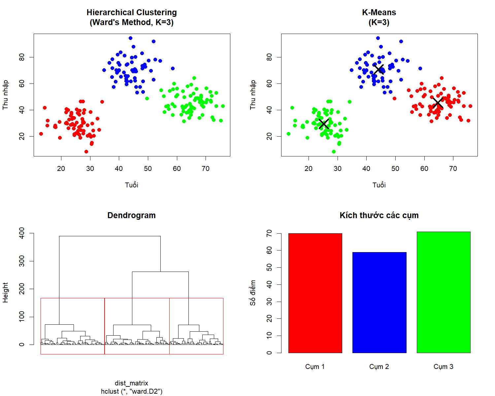<!-- -->

``` r
par(mfrow = c(1, 1))
```

**Phân tích kết quả:**

``` r
data.frame(
  Cum = 1:3,
  So_luong = as.numeric(table(clusters_hc)),
  Tuoi_TB = round(tapply(customers_hc$Age, clusters_hc, mean), 1),
  Thu_nhap_TB = round(tapply(customers_hc$Income, clusters_hc, mean), 1)
)
```

    ##   Cum So_luong Tuoi_TB Thu_nhap_TB
    ## 1   1       70    25.2        29.5
    ## 2   2       59    44.2        70.8
    ## 3   3       71    64.7        45.5

### 2.5.8 So sánh Hierarchical vs K-Means

| Tiêu chí | K-Means | Hierarchical |
|----|----|----|
| **Tốc độ** | Nhanh O(nkt) | Chậm O(n³) |
| **Chọn K** | Phải chọn trước | Có thể chọn sau |
| **Dendrogram** | Không | Có |
| **Dữ liệu lớn** | Tốt (hàng triệu điểm) | Kém (\< 10,000 điểm) |
| **Kết quả** | Khác nhau mỗi lần (nstart=1) | Cố định |
| **Hình dạng cụm** | Cầu (spherical) | Linh hoạt hơn |
| **Ứng dụng** | Phân khúc lớn, real-time | Phân tích khám phá, sinh học |

**Khi nào dùng Hierarchical?**

- ✅ Dữ liệu nhỏ (\< 10,000 điểm)
- ✅ Cần xem cấu trúc phân cấp
- ✅ Không biết K trước
- ✅ Cần kết quả ổn định

**Khi nào dùng K-Means?**

- ✅ Dữ liệu lớn
- ✅ Cần tốc độ
- ✅ Biết K trước
- ✅ Cụm hình cầu

------------------------------------------------------------------------

## 2.6 DBSCAN (Density-Based Spatial Clustering)

### 2.6.1 Giới thiệu

**DBSCAN** = Density-Based Spatial Clustering of Applications with Noise

**Ý tưởng cốt lõi:** Tìm cụm dựa trên **mật độ**, không phải khoảng
cách.

**Điểm mạnh:**

- ✅ KHÔNG cần chọn K trước
- ✅ Tìm được cụm **hình dạng bất kỳ** (không chỉ hình cầu)
- ✅ Tự động phát hiện **outliers** (noise)
- ✅ Ít nhạy cảm với thứ tự dữ liệu

**Điểm yếu:**

- ❌ Khó xác định tham số eps và minPts
- ❌ Không tốt với cụm có **mật độ khác nhau**
- ❌ Không tốt với dữ liệu **chiều cao**

### 2.6.2 Khái niệm cơ bản

**3 loại điểm:**

**1. Core Point (Điểm lõi)**

- Có ít nhất **minPts** điểm trong bán kính **eps**
- Là trung tâm của cụm

**2. Border Point (Điểm biên)**

- Nằm trong bán kính eps của core point
- Không đủ điểm láng giềng để là core point
- Thuộc cụm nhưng ở rìa

**3. Noise Point (Điểm nhiễu)**

- KHÔNG phải core, KHÔNG phải border
- Là **outlier**

**Minh họa 3 loại điểm:**

``` r
set.seed(42)

# Tạo dữ liệu mẫu
example_points <- data.frame(
  x = c(2, 2.5, 2.2, 2.8, 2.1,  8, 8.3,  5),
  y = c(2, 2.3, 1.8, 2.5, 2.4,  8, 8.2,  5)
)

# eps = 1, minPts = 3
eps <- 1
minPts <- 3

plot(example_points$x, example_points$y, pch = 19, cex = 3,
     col = "gray", xlim = c(0, 10), ylim = c(0, 10),
     xlab = "X", ylab = "Y",
     main = paste("DBSCAN: eps =", eps, ", minPts =", minPts))

# Vẽ vòng tròn eps cho điểm 1 (core)
theta <- seq(0, 2*pi, length.out = 100)
lines(example_points$x[1] + eps*cos(theta), 
      example_points$y[1] + eps*sin(theta),
      col = "red", lwd = 2)
points(example_points$x[1], example_points$y[1], pch = 19, cex = 3, col = "red")
text(example_points$x[1], example_points$y[1] - 0.3, "CORE", col = "red", font = 2)

# Vẽ vòng tròn eps cho điểm 6 (border)
lines(example_points$x[6] + eps*cos(theta), 
      example_points$y[6] + eps*sin(theta),
      col = "blue", lwd = 2)
points(example_points$x[6], example_points$y[6], pch = 19, cex = 3, col = "blue")
text(example_points$x[6], example_points$y[6] - 0.3, "CORE", col = "blue", font = 2)

# Điểm 7 là border (gần điểm 6)
points(example_points$x[7], example_points$y[7], pch = 19, cex = 3, col = "lightblue")
text(example_points$x[7], example_points$y[7] - 0.3, "BORDER", col = "blue", font = 2)

# Điểm 8 là noise
points(example_points$x[8], example_points$y[8], pch = 4, cex = 3, lwd = 3, col = "black")
text(example_points$x[8], example_points$y[8] + 0.5, "NOISE", col = "black", font = 2)

legend("topright", 
       legend = c("Core Point", "Border Point", "Noise Point"),
       col = c("red", "lightblue", "black"),
       pch = c(19, 19, 4), cex = 1)
```

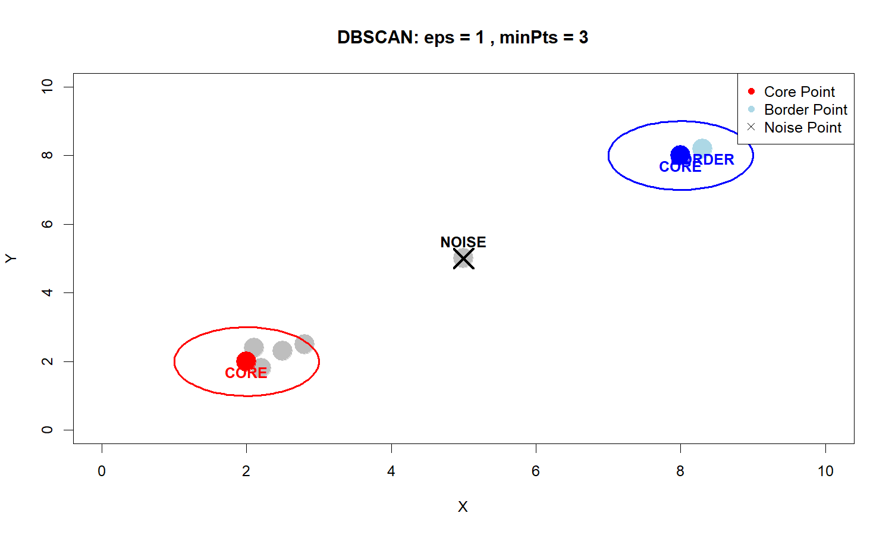<!-- -->

### 2.6.3 Hai tham số quan trọng

**1. eps (epsilon)**

- Bán kính vùng láng giềng
- eps nhỏ → nhiều cụm nhỏ + nhiều noise
- eps lớn → ít cụm lớn + ít noise

**2. minPts (minimum points)**

- Số điểm tối thiểu để là core point
- minPts nhỏ → nhiều core points
- minPts lớn → ít core points, nhiều noise
- **Khuyến nghị**: minPts ≥ số chiều + 1

**Ảnh hưởng của eps và minPts:**

``` r
library(dbscan)

set.seed(123)
data_dbscan <- data.frame(
  x = c(rnorm(50, 2, 0.5), rnorm(50, 8, 0.6), rnorm(50, 5, 0.5)),
  y = c(rnorm(50, 2, 0.5), rnorm(50, 3, 0.6), rnorm(50, 7, 0.5))
)

par(mfrow = c(2, 3))

# Thử nghiệm eps
db1 <- dbscan(data_dbscan, eps = 0.3, minPts = 5)
plot(data_dbscan, col = db1$cluster + 1, pch = 19, cex = 1.2,
     main = "eps = 0.3, minPts = 5\nQuá nhỏ → Nhiều noise")
points(data_dbscan[db1$cluster == 0, ], col = "black", pch = 4, cex = 1.5, lwd = 2)

db2 <- dbscan(data_dbscan, eps = 0.8, minPts = 5)
plot(data_dbscan, col = db2$cluster + 1, pch = 19, cex = 1.2,
     main = "eps = 0.8, minPts = 5\nVừa phải")
points(data_dbscan[db2$cluster == 0, ], col = "black", pch = 4, cex = 1.5, lwd = 2)

db3 <- dbscan(data_dbscan, eps = 2.0, minPts = 5)
plot(data_dbscan, col = db3$cluster + 1, pch = 19, cex = 1.2,
     main = "eps = 2.0, minPts = 5\nQuá lớn → 1 cụm")
points(data_dbscan[db3$cluster == 0, ], col = "black", pch = 4, cex = 1.5, lwd = 2)

# Thử nghiệm minPts
db4 <- dbscan(data_dbscan, eps = 0.8, minPts = 3)
plot(data_dbscan, col = db4$cluster + 1, pch = 19, cex = 1.2,
     main = "eps = 0.8, minPts = 3\nNhiều cụm nhỏ")
points(data_dbscan[db4$cluster == 0, ], col = "black", pch = 4, cex = 1.5, lwd = 2)

db5 <- dbscan(data_dbscan, eps = 0.8, minPts = 5)
plot(data_dbscan, col = db5$cluster + 1, pch = 19, cex = 1.2,
     main = "eps = 0.8, minPts = 5\nVừa phải")
points(data_dbscan[db5$cluster == 0, ], col = "black", pch = 4, cex = 1.5, lwd = 2)

db6 <- dbscan(data_dbscan, eps = 0.8, minPts = 10)
plot(data_dbscan, col = db6$cluster + 1, pch = 19, cex = 1.2,
     main = "eps = 0.8, minPts = 10\nNhiều noise")
points(data_dbscan[db6$cluster == 0, ], col = "black", pch = 4, cex = 1.5, lwd = 2)
```

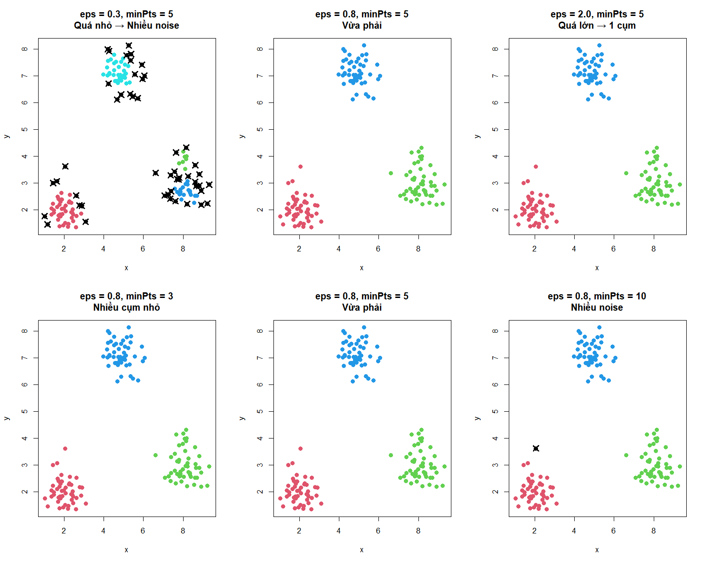<!-- -->

``` r
par(mfrow = c(1, 1))
```

**Kết quả với các tham số:**

``` r
data.frame(
  Setting = c("eps=0.3, minPts=5", "eps=0.8, minPts=5", "eps=2.0, minPts=5",
              "eps=0.8, minPts=3", "eps=0.8, minPts=5", "eps=0.8, minPts=10"),
  So_cum = c(max(db1$cluster), max(db2$cluster), max(db3$cluster),
             max(db4$cluster), max(db5$cluster), max(db6$cluster)),
  So_noise = c(sum(db1$cluster == 0), sum(db2$cluster == 0), sum(db3$cluster == 0),
               sum(db4$cluster == 0), sum(db5$cluster == 0), sum(db6$cluster == 0))
)
```

    ##              Setting So_cum So_noise
    ## 1  eps=0.3, minPts=5      4       49
    ## 2  eps=0.8, minPts=5      3        0
    ## 3  eps=2.0, minPts=5      3        0
    ## 4  eps=0.8, minPts=3      3        0
    ## 5  eps=0.8, minPts=5      3        0
    ## 6 eps=0.8, minPts=10      3        1

### 2.6.4 Thuật toán DBSCAN

**Các bước:**

1.  Chọn 1 điểm chưa thăm ngẫu nhiên
2.  Tìm tất cả điểm trong bán kính eps
3.  Nếu số điểm ≥ minPts → Tạo cụm mới
4.  Mở rộng cụm bằng cách tìm láng giềng của láng giềng
5.  Lặp lại với điểm chưa thăm tiếp theo
6.  Điểm không thuộc cụm nào → Noise

**Minh họa thuật toán:**

``` r
set.seed(42)

# Dữ liệu nhỏ
small_db <- data.frame(
  x = c(1, 1.5, 1.2, 2, 2.3,  8, 8.5, 8.2, 9,  5),
  y = c(1, 1.3, 0.8, 1.5, 1.8,  8, 8.3, 7.8, 8.5,  5)
)

eps_val <- 1
minPts_val <- 3

par(mfrow = c(3, 2))

# Bước 1: Tất cả điểm chưa gán
plot(small_db$x, small_db$y, pch = 19, cex = 2, col = "gray",
     xlim = c(0, 10), ylim = c(0, 10),
     main = "Bước 1: Chưa gán nhãn",
     xlab = "X", ylab = "Y")
text(small_db$x, small_db$y + 0.4, 1:10, font = 2)

# Bước 2: Chọn điểm 1, tìm láng giềng
plot(small_db$x, small_db$y, pch = 19, cex = 2, col = "gray",
     xlim = c(0, 10), ylim = c(0, 10),
     main = paste("Bước 2: Điểm 1 có", sum(dist(rbind(small_db[1,], small_db))[-1] < eps_val), "láng giềng"),
     xlab = "X", ylab = "Y")
theta <- seq(0, 2*pi, length.out = 100)
lines(small_db$x[1] + eps_val*cos(theta), 
      small_db$y[1] + eps_val*sin(theta), col = "red", lwd = 2)
points(small_db$x[1], small_db$y[1], pch = 19, cex = 2, col = "red")

# Bước 3: Tạo Cụm 1
cluster_labels <- rep(0, 10)
cluster_labels[c(1,2,3,4,5)] <- 1
plot(small_db$x, small_db$y, pch = 19, cex = 2, 
     col = ifelse(cluster_labels == 1, "red", "gray"),
     xlim = c(0, 10), ylim = c(0, 10),
     main = "Bước 3: Cụm 1 (điểm 1-5)",
     xlab = "X", ylab = "Y")

# Bước 4: Chọn điểm 6
plot(small_db$x, small_db$y, pch = 19, cex = 2, 
     col = ifelse(cluster_labels == 1, "red", "gray"),
     xlim = c(0, 10), ylim = c(0, 10),
     main = "Bước 4: Điểm 6 có láng giềng",
     xlab = "X", ylab = "Y")
lines(small_db$x[6] + eps_val*cos(theta), 
      small_db$y[6] + eps_val*sin(theta), col = "blue", lwd = 2)
points(small_db$x[6], small_db$y[6], pch = 19, cex = 2, col = "blue")

# Bước 5: Tạo Cụm 2
cluster_labels[c(6,7,8,9)] <- 2
plot(small_db$x, small_db$y, pch = 19, cex = 2, 
     col = c("gray", "red", "blue")[cluster_labels + 1],
     xlim = c(0, 10), ylim = c(0, 10),
     main = "Bước 5: Cụm 2 (điểm 6-9)",
     xlab = "X", ylab = "Y")

# Bước 6: Điểm 10 là Noise
plot(small_db$x, small_db$y, pch = ifelse(cluster_labels == 0, 4, 19), 
     cex = 2, lwd = 2,
     col = c("black", "red", "blue")[cluster_labels + 1],
     xlim = c(0, 10), ylim = c(0, 10),
     main = "Bước 6: Điểm 10 = NOISE",
     xlab = "X", ylab = "Y")
text(small_db$x[10], small_db$y[10] + 0.5, "NOISE", col = "black", font = 2)
```

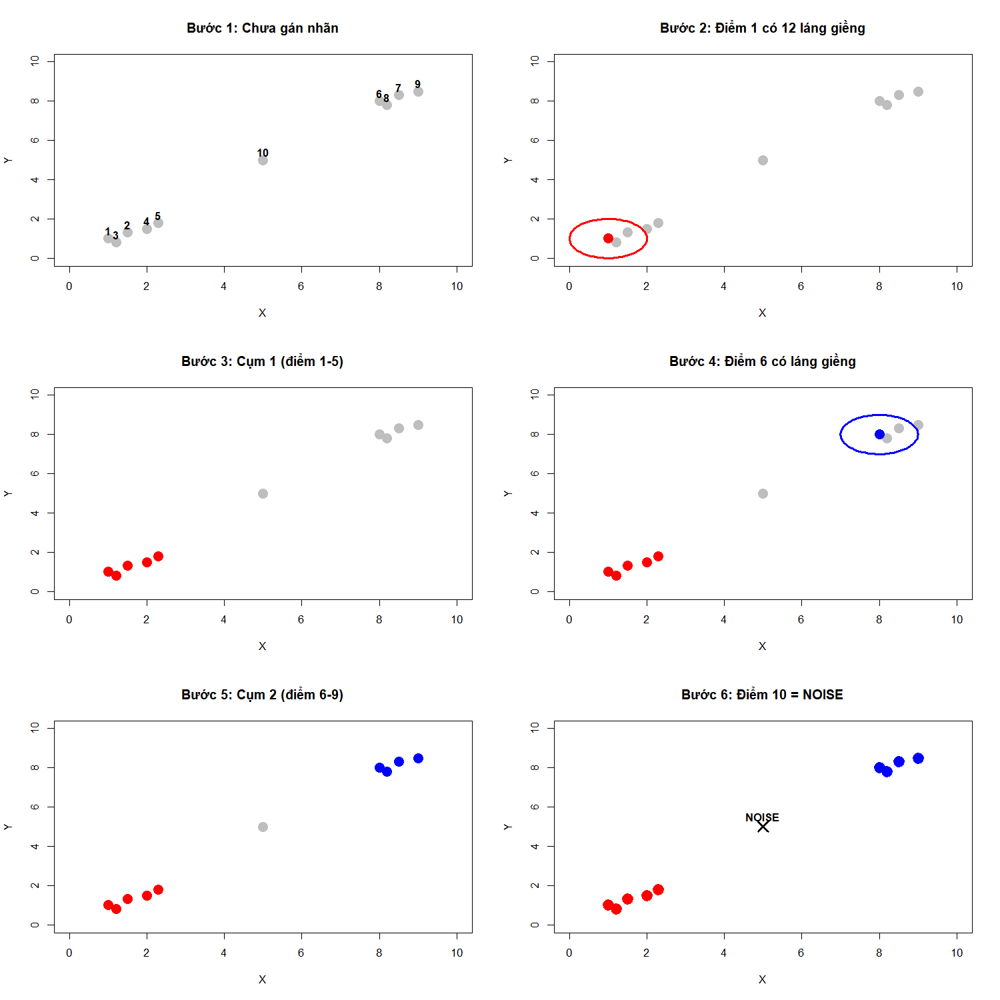<!-- -->

``` r
par(mfrow = c(1, 1))
```

### 2.6.5 Chọn eps tối ưu: k-distance graph

**Phương pháp k-NN distance:**

1.  Với mỗi điểm, tính khoảng cách đến láng giềng thứ k (k = minPts)
2.  Sắp xếp khoảng cách tăng dần
3.  Vẽ biểu đồ
4.  Tìm điểm “khuỷu tay” → eps tối ưu

``` r
# Tính k-NN distance
k <- 5  # minPts
knn_dist <- kNNdist(data_dbscan, k = k)
knn_sorted <- sort(knn_dist)

plot(knn_sorted, type = "l", lwd = 2, col = "blue",
     xlab = "Điểm (sắp xếp)", 
     ylab = paste(k, "-NN Distance"),
     main = "k-NN Distance Graph\nTìm eps tối ưu")
grid()

# Đánh dấu elbow
abline(h = 0.8, col = "red", lty = 2, lwd = 2)
text(100, 0.9, "eps ≈ 0.8", col = "red", font = 2)

# Vùng tăng đột ngột
points(130, knn_sorted[130], col = "red", pch = 19, cex = 2)
```

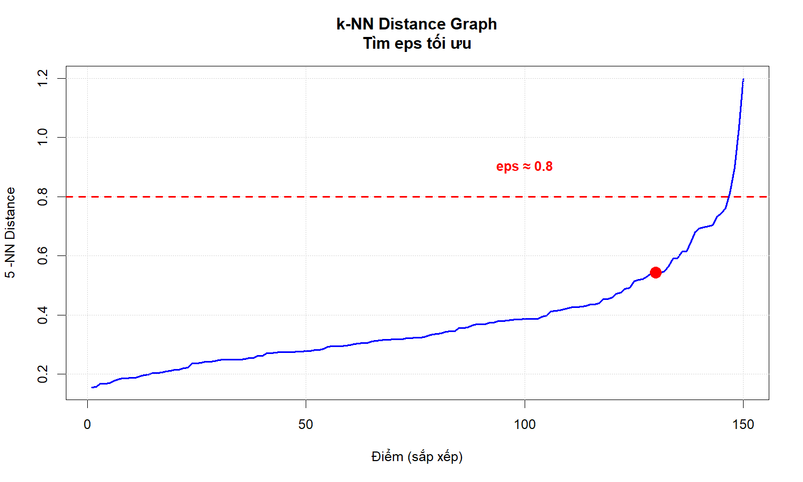<!-- -->

**Giải thích:**

- Trước elbow: Điểm gần nhau (trong cụm)
- Sau elbow: Điểm xa nhau (noise/outliers)
- Chọn eps ≈ giá trị tại elbow

### 2.6.6 Ưu điểm của DBSCAN

**1. Tìm cụm hình dạng bất kỳ**

``` r
# Tạo dữ liệu hình dạng phức tạp
set.seed(123)

# Hình vòng tròn
theta_vals <- seq(0, 2*pi, length.out = 100)
circle_data <- data.frame(
  x = 5 + 3*cos(theta_vals) + rnorm(100, 0, 0.2),
  y = 5 + 3*sin(theta_vals) + rnorm(100, 0, 0.2)
)

# Điểm trung tâm
center_data <- data.frame(
  x = rnorm(50, 5, 0.3),
  y = rnorm(50, 5, 0.3)
)

# Noise
noise_data <- data.frame(
  x = runif(20, 0, 10),
  y = runif(20, 0, 10)
)

complex_data <- rbind(circle_data, center_data, noise_data)

par(mfrow = c(1, 2))

# K-Means (THẤT BẠI)
km_complex <- kmeans(complex_data, centers = 2, nstart = 25)
plot(complex_data$x, complex_data$y,
     col = c("red", "blue")[km_complex$cluster],
     pch = 19, cex = 1,
     main = "K-Means: THẤT BẠI\nKhông nhận dạng được hình vòng",
     xlab = "X", ylab = "Y")
points(km_complex$centers, pch = 4, cex = 3, lwd = 3)

# DBSCAN (THÀNH CÔNG)
db_complex <- dbscan(complex_data, eps = 0.5, minPts = 5)
plot(complex_data$x, complex_data$y,
     col = db_complex$cluster + 1, 
     pch = ifelse(db_complex$cluster == 0, 4, 19),
     cex = 1, lwd = 2,
     main = "DBSCAN: THÀNH CÔNG\nNhận dạng 2 cụm + noise",
     xlab = "X", ylab = "Y")
```

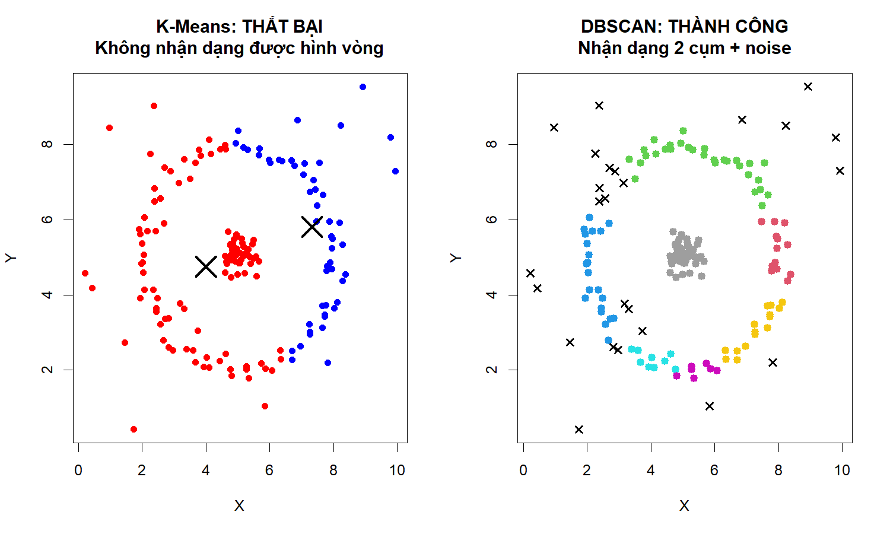<!-- -->

``` r
par(mfrow = c(1, 1))
```

**2. Tự động phát hiện outliers**

``` r
# Dữ liệu có outliers
set.seed(456)
normal_pts <- data.frame(
  x = rnorm(100, 5, 1),
  y = rnorm(100, 5, 1)
)
outliers_pts <- data.frame(
  x = c(0, 10, 0, 10),
  y = c(0, 0, 10, 10)
)
data_with_outliers <- rbind(normal_pts, outliers_pts)

par(mfrow = c(1, 2))

# K-Means bị ảnh hưởng
km_out <- kmeans(data_with_outliers, centers = 2, nstart = 25)
plot(data_with_outliers$x, data_with_outliers$y,
     col = c("red", "blue")[km_out$cluster],
     pch = 19, cex = 1.2,
     main = "K-Means\nBị ảnh hưởng bởi outliers",
     xlab = "X", ylab = "Y")
points(km_out$centers, pch = 4, cex = 3, lwd = 3)

# DBSCAN loại bỏ outliers
db_out <- dbscan(data_with_outliers, eps = 0.5, minPts = 5)
plot(data_with_outliers$x, data_with_outliers$y,
     col = ifelse(db_out$cluster == 0, "black", "red"),
     pch = ifelse(db_out$cluster == 0, 4, 19),
     cex = 1.2, lwd = 2,
     main = "DBSCAN\nTự động phát hiện outliers",
     xlab = "X", ylab = "Y")
```

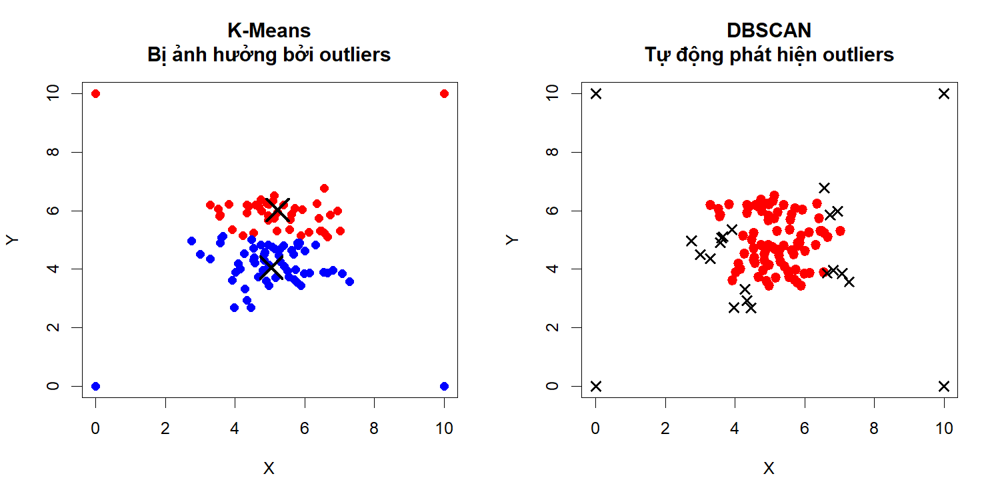<!-- -->

``` r
par(mfrow = c(1, 1))
```

### 2.6.7 Ví dụ thực tế

``` r
# Dùng dữ liệu khách hàng
set.seed(42)
customers_db <- data.frame(
  Age = c(rnorm(70, 25, 4), rnorm(60, 45, 5), rnorm(70, 65, 6)),
  Income = c(rnorm(70, 30, 8), rnorm(60, 70, 10), rnorm(70, 45, 8))
)

# Tìm eps tối ưu
knn_dist_cust <- kNNdist(customers_db, k = 5)
eps_optimal <- 6  # Từ k-NN graph

# DBSCAN
db_customers <- dbscan(customers_db, eps = eps_optimal, minPts = 5)

par(mfrow = c(2, 2))

# k-NN distance graph
plot(sort(knn_dist_cust), type = "l", lwd = 2, col = "blue",
     main = "k-NN Distance\nChọn eps ≈ 6",
     xlab = "Điểm", ylab = "5-NN Distance")
abline(h = eps_optimal, col = "red", lty = 2, lwd = 2)

# DBSCAN result
plot(customers_db$Age, customers_db$Income,
     col = db_customers$cluster + 1,
     pch = ifelse(db_customers$cluster == 0, 4, 19),
     cex = 1.5, lwd = 2,
     xlab = "Tuổi", ylab = "Thu nhập",
     main = paste("DBSCAN: eps =", eps_optimal, ", minPts = 5"))
legend("topright", 
       legend = c(paste("Cụm", 1:max(db_customers$cluster)), "Noise"),
       col = 2:(max(db_customers$cluster)+2), 
       pch = c(rep(19, max(db_customers$cluster)), 4))

# So sánh với K-Means
km_cust <- kmeans(customers_db, centers = 3, nstart = 25)
plot(customers_db$Age, customers_db$Income,
     col = c("red", "blue", "green")[km_cust$cluster],
     pch = 19, cex = 1.5,
     xlab = "Tuổi", ylab = "Thu nhập",
     main = "K-Means (K=3)")
points(km_cust$centers, pch = 4, cex = 3, lwd = 3)

# Cluster sizes
barplot(table(db_customers$cluster), 
        names.arg = c("Noise", paste("Cụm", 1:max(db_customers$cluster))),
        col = c("black", rainbow(max(db_customers$cluster))),
        main = "Phân bố điểm",
        ylab = "Số điểm")
```

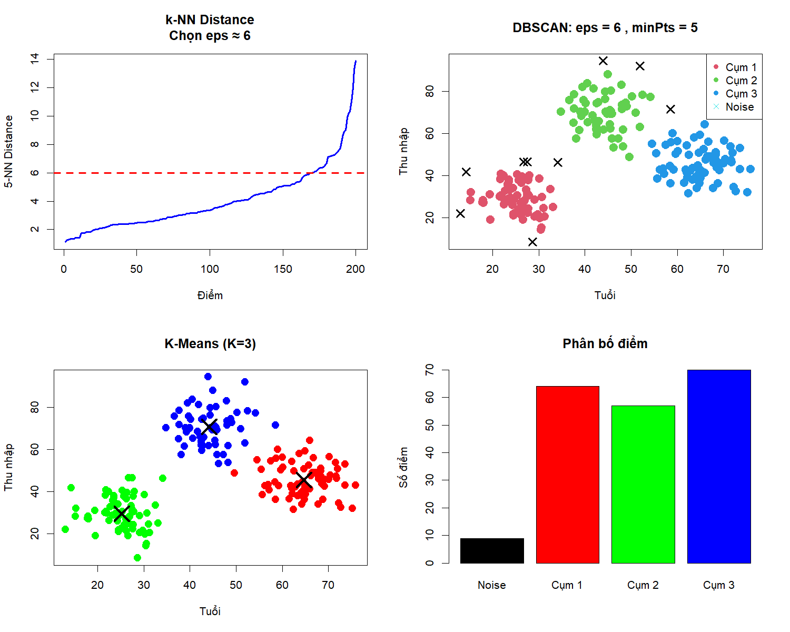<!-- -->

``` r
par(mfrow = c(1, 1))
```

**Phân tích kết quả:**

``` r
# Loại bỏ noise
valid_clusters <- db_customers$cluster[db_customers$cluster != 0]
valid_data <- customers_db[db_customers$cluster != 0, ]

if(max(db_customers$cluster) > 0) {
  data.frame(
    Cum = 1:max(db_customers$cluster),
    So_luong = as.numeric(table(valid_clusters)),
    Tuoi_TB = round(tapply(valid_data$Age, valid_clusters, mean), 1),
    Thu_nhap_TB = round(tapply(valid_data$Income, valid_clusters, mean), 1)
  )
}
```

    ##   Cum So_luong Tuoi_TB Thu_nhap_TB
    ## 1   1       64    25.3        29.0
    ## 2   2       57    43.9        69.6
    ## 3   3       70    64.9        45.4

``` r
# Số noise
sum(db_customers$cluster == 0)
```

    ## [1] 9

### 2.6.8 So sánh 3 thuật toán

``` r
par(mfrow = c(1, 3))

# K-Means
km_final <- kmeans(customers_db, centers = 3, nstart = 25)
plot(customers_db$Age, customers_db$Income,
     col = c("red", "blue", "green")[km_final$cluster],
     pch = 19, cex = 1.2,
     xlab = "Tuổi", ylab = "Thu nhập",
     main = "K-Means")
points(km_final$centers, pch = 4, cex = 2.5, lwd = 2.5)

# Hierarchical
hc_final <- hclust(dist(customers_db), method = "ward.D2")
clusters_hc_final <- cutree(hc_final, k = 3)
plot(customers_db$Age, customers_db$Income,
     col = c("red", "blue", "green")[clusters_hc_final],
     pch = 19, cex = 1.2,
     xlab = "Tuổi", ylab = "Thu nhập",
     main = "Hierarchical")

# DBSCAN
plot(customers_db$Age, customers_db$Income,
     col = db_customers$cluster + 1,
     pch = ifelse(db_customers$cluster == 0, 4, 19),
     cex = 1.2, lwd = 2,
     xlab = "Tuổi", ylab = "Thu nhập",
     main = "DBSCAN")
```

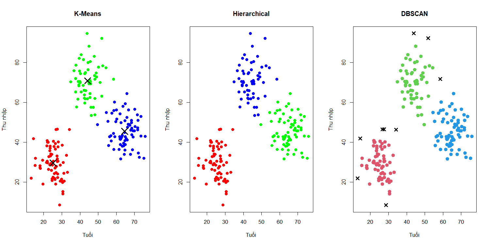<!-- -->

``` r
par(mfrow = c(1, 1))
```

**Bảng tổng hợp:**

| Tiêu chí        | K-Means      | Hierarchical | DBSCAN                |
|-----------------|--------------|--------------|-----------------------|
| **Chọn K**      | Phải chọn    | Chọn sau     | Tự động               |
| **Hình dạng**   | Hình cầu     | Linh hoạt    | Bất kỳ                |
| **Outliers**    | Nhạy cảm     | Nhạy cảm     | Tự phát hiện          |
| **Tốc độ**      | Nhanh O(nkt) | Chậm O(n³)   | Trung bình O(n log n) |
| **Dữ liệu lớn** | Tốt          | Kém          | Khá tốt               |
| **Tham số**     | K, nstart    | K, linkage   | eps, minPts           |
| **Kết quả**     | Khác nhau    | Cố định      | Cố định               |

**Khi nào dùng DBSCAN?**

- ✅ Cụm hình dạng phức tạp
- ✅ Có nhiều outliers
- ✅ Không biết K trước
- ✅ Cần tự động phát hiện noise

------------------------------------------------------------------------

## 2.7 Dự án thực hành: So sánh 3 thuật toán Clustering

### 2.7.1 Mô tả dự án

**Bài toán:** Phân khúc khách hàng của một cửa hàng bán lẻ

**Dữ liệu:** 300 khách hàng với 3 đặc điểm: - Tuổi (Age) - Thu nhập hàng
tháng (Income) - Điểm chi tiêu hàng năm (Spending Score: 1-100)

**Mục tiêu:** 1. Áp dụng 3 thuật toán: K-Means, Hierarchical, DBSCAN 2.
So sánh kết quả 3. Đánh giá bằng các chỉ số 4. Đưa ra khuyến nghị thuật
toán phù hợp nhất

### 2.7.2 Chuẩn bị dữ liệu

``` r
set.seed(2026)

# Tạo dữ liệu khách hàng thực tế hơn
# Nhóm 1: Sinh viên - Trẻ, thu nhập thấp, chi tiêu thấp
group1 <- data.frame(
  Age = rnorm(80, 22, 3),
  Income = rnorm(80, 25, 5),
  Spending = rnorm(80, 30, 8)
)

# Nhóm 2: Trung niên - Trung tuổi, thu nhập cao, chi tiêu cao
group2 <- data.frame(
  Age = rnorm(100, 45, 6),
  Income = rnorm(100, 80, 12),
  Spending = rnorm(100, 75, 10)
)

# Nhóm 3: Người cao tuổi - Lớn tuổi, thu nhập trung bình, chi tiêu vừa
group3 <- data.frame(
  Age = rnorm(90, 65, 5),
  Income = rnorm(90, 50, 8),
  Spending = rnorm(90, 50, 10)
)

# Nhóm 4: Outliers - Một số khách hàng đặc biệt
outliers <- data.frame(
  Age = c(18, 75, 30, 55),
  Income = c(15, 120, 90, 35),
  Spending = c(95, 20, 10, 90)
)

# Gộp tất cả
customers_project <- rbind(group1, group2, group3, outliers)
customers_project$CustomerID <- 1:nrow(customers_project)

# Sắp xếp lại cột
customers_project <- customers_project[, c("CustomerID", "Age", "Income", "Spending")]

# Xem dữ liệu
head(customers_project, 10)
```

    ##    CustomerID      Age   Income Spending
    ## 1           1 23.56177 19.22211 41.24325
    ## 2           2 18.76093 32.54458 23.07784
    ## 3           3 22.41771 19.22252 23.00837
    ## 4           4 21.74575 17.21594 36.19455
    ## 5           5 20.00008 24.72376 26.78488
    ## 6           6 14.45173 29.24597 28.27890
    ## 7           7 19.79456 24.94452 34.84205
    ## 8           8 18.93963 21.19843 25.08346
    ## 9           9 22.34066 30.87900 24.20462
    ## 10         10 20.57863 37.07225 27.94446

**Thống kê mô tả:**

``` r
summary(customers_project[, 2:4])
```

    ##       Age            Income          Spending      
    ##  Min.   :14.36   Min.   : 15.00   Min.   :  9.718  
    ##  1st Qu.:24.34   1st Qu.: 30.30   1st Qu.: 35.982  
    ##  Median :45.57   Median : 51.06   Median : 53.049  
    ##  Mean   :45.03   Mean   : 53.49   Mean   : 54.176  
    ##  3rd Qu.:62.60   3rd Qu.: 73.61   3rd Qu.: 70.784  
    ##  Max.   :79.07   Max.   :120.00   Max.   :106.434

**Visualization dữ liệu gốc:**

``` r
par(mfrow = c(2, 2))

# Age vs Income
plot(customers_project$Age, customers_project$Income,
     pch = 19, cex = 1.2, col = "steelblue",
     xlab = "Tuổi", ylab = "Thu nhập (triệu/tháng)",
     main = "Age vs Income")

# Age vs Spending
plot(customers_project$Age, customers_project$Spending,
     pch = 19, cex = 1.2, col = "steelblue",
     xlab = "Tuổi", ylab = "Spending Score (0-100)",
     main = "Age vs Spending Score")

# Income vs Spending
plot(customers_project$Income, customers_project$Spending,
     pch = 19, cex = 1.2, col = "steelblue",
     xlab = "Thu nhập", ylab = "Spending Score",
     main = "Income vs Spending Score")

# Histogram Age
hist(customers_project$Age, breaks = 20, col = "lightblue",
     xlab = "Tuổi", main = "Phân bố Tuổi")
```

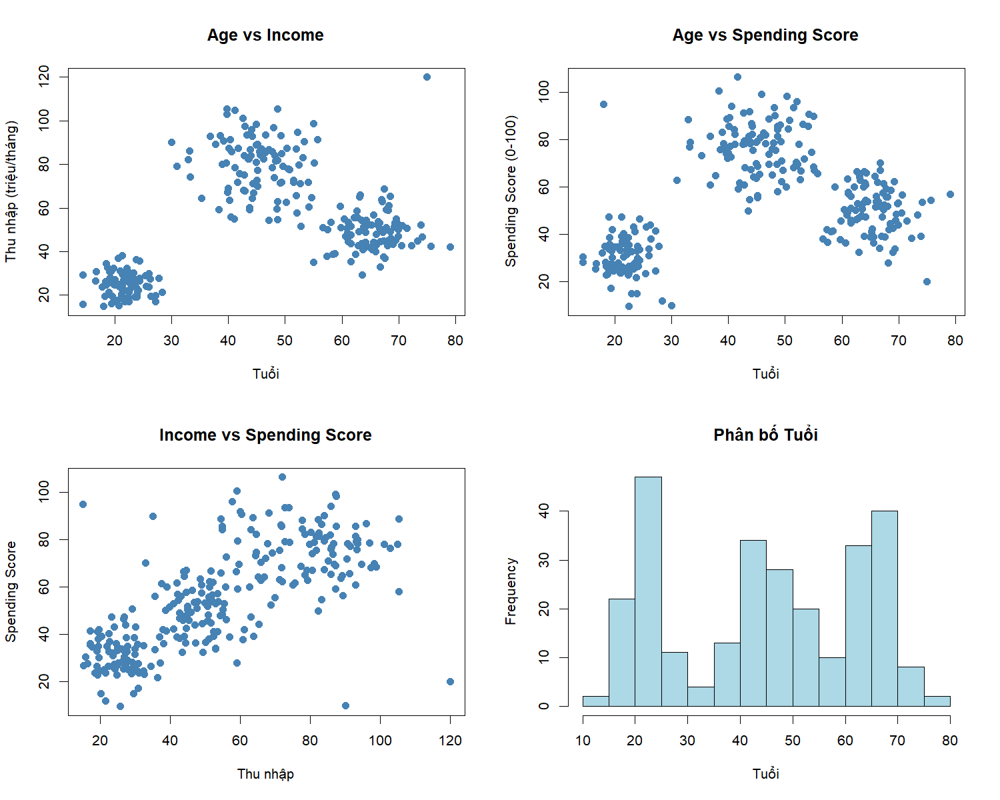<!-- -->

``` r
par(mfrow = c(1, 1))
```

### 2.7.3 Thuật toán 1: K-Means

**Bước 1: Chọn K tối ưu bằng Elbow Method**

``` r
# Chuẩn bị dữ liệu (bỏ CustomerID)
data_clustering <- customers_project[, 2:4]

# Tính WSS cho K = 1 đến 10
wss_kmeans <- sapply(1:10, function(k) {
  kmeans(data_clustering, centers = k, nstart = 25)$tot.withinss
})

par(mfrow = c(1, 2))

# Elbow plot
plot(1:10, wss_kmeans, type = "b", pch = 19, col = "blue", lwd = 2, cex = 1.5,
     xlab = "Số cụm K", ylab = "WSS",
     main = "K-Means: Elbow Method")
grid()
points(3, wss_kmeans[3], col = "red", pch = 19, cex = 3)
text(3, wss_kmeans[3] + 5000, "K = 3", col = "red", font = 2)

# % giảm
pct_decrease_km <- c(NA, -diff(wss_kmeans)/wss_kmeans[-10]*100)
plot(2:10, pct_decrease_km[-1], type = "b", pch = 19, col = "darkgreen", lwd = 2,
     xlab = "K", ylab = "% Giảm WSS", main = "Tốc độ giảm WSS")
abline(h = 10, col = "red", lty = 2)
```

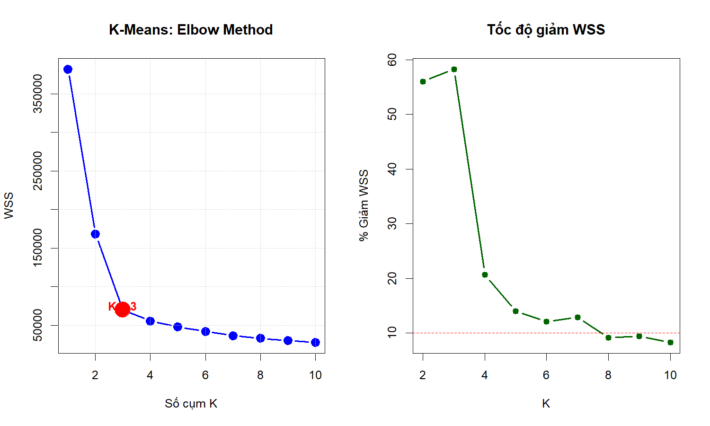<!-- -->

``` r
par(mfrow = c(1, 1))
```

**Bước 2: Áp dụng K-Means với K = 3**

``` r
# K-Means với K = 3
km_result <- kmeans(data_clustering, centers = 3, nstart = 50)

# Gán nhãn
customers_project$KMeans_Cluster <- km_result$cluster

# Centroids
km_result$centers
```

    ##        Age   Income Spending
    ## 1 45.43208 80.59050 76.42318
    ## 2 21.69737 25.24239 31.43232
    ## 3 64.70781 49.30093 50.34241

**Bước 3: Visualization**

``` r
par(mfrow = c(2, 2))

# Age vs Income
plot(customers_project$Age, customers_project$Income,
     col = c("red", "blue", "green")[km_result$cluster],
     pch = 19, cex = 1.3,
     xlab = "Tuổi", ylab = "Thu nhập",
     main = "K-Means: Age vs Income")
points(km_result$centers[, 1:2], pch = 4, cex = 3, lwd = 3)

# Age vs Spending
plot(customers_project$Age, customers_project$Spending,
     col = c("red", "blue", "green")[km_result$cluster],
     pch = 19, cex = 1.3,
     xlab = "Tuổi", ylab = "Spending Score",
     main = "K-Means: Age vs Spending")
points(km_result$centers[, c(1,3)], pch = 4, cex = 3, lwd = 3)

# Income vs Spending
plot(customers_project$Income, customers_project$Spending,
     col = c("red", "blue", "green")[km_result$cluster],
     pch = 19, cex = 1.3,
     xlab = "Thu nhập", ylab = "Spending Score",
     main = "K-Means: Income vs Spending")
points(km_result$centers[, 2:3], pch = 4, cex = 3, lwd = 3)

# Cluster sizes
barplot(table(km_result$cluster), 
        names.arg = paste("Cụm", 1:3),
        col = c("red", "blue", "green"),
        main = "K-Means: Kích thước cụm",
        ylab = "Số khách hàng")
```

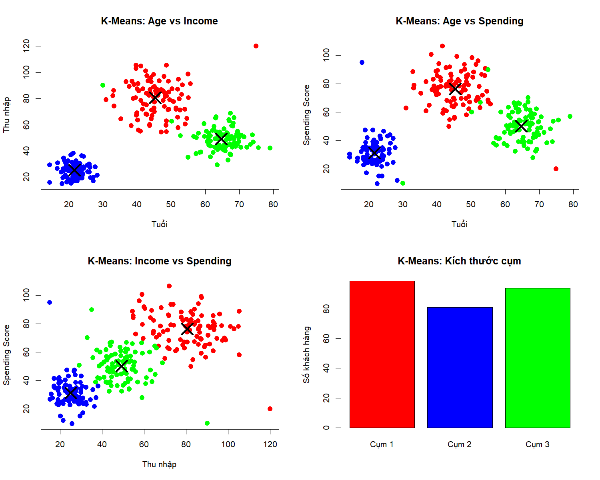<!-- -->

``` r
par(mfrow = c(1, 1))
```

### 2.7.4 Thuật toán 2: Hierarchical Clustering

**Bước 1: Xây dựng Dendrogram**

``` r
# Tính distance matrix
dist_matrix <- dist(data_clustering)

# Hierarchical clustering (Ward's method)
hc_result <- hclust(dist_matrix, method = "ward.D2")

# Vẽ dendrogram
plot(hc_result, labels = FALSE, hang = -1,
     main = "Hierarchical Clustering: Dendrogram (Ward's Method)",
     xlab = "", sub = "")
rect.hclust(hc_result, k = 3, border = "red")
abline(h = 60, col = "blue", lty = 2, lwd = 2)
text(150, 65, "Cắt ở đây → K = 3", col = "blue", font = 2)
```

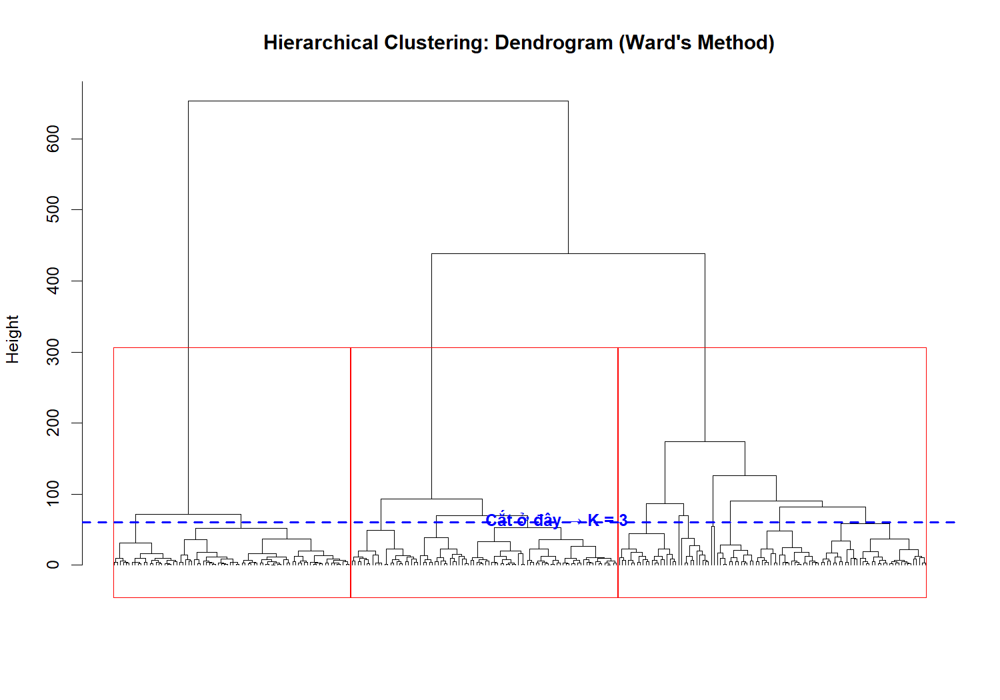<!-- -->

**Bước 2: Chọn K = 3 và gán nhãn**

``` r
# Cắt dendrogram tại K = 3
hc_clusters <- cutree(hc_result, k = 3)

# Gán nhãn
customers_project$HC_Cluster <- hc_clusters

# Kích thước cụm
table(hc_clusters)
```

    ## hc_clusters
    ##   1   2   3 
    ##  80 104  90

**Bước 3: Visualization**

``` r
par(mfrow = c(2, 2))

# Age vs Income
plot(customers_project$Age, customers_project$Income,
     col = c("red", "blue", "green")[hc_clusters],
     pch = 19, cex = 1.3,
     xlab = "Tuổi", ylab = "Thu nhập",
     main = "Hierarchical: Age vs Income")

# Age vs Spending
plot(customers_project$Age, customers_project$Spending,
     col = c("red", "blue", "green")[hc_clusters],
     pch = 19, cex = 1.3,
     xlab = "Tuổi", ylab = "Spending Score",
     main = "Hierarchical: Age vs Spending")

# Income vs Spending
plot(customers_project$Income, customers_project$Spending,
     col = c("red", "blue", "green")[hc_clusters],
     pch = 19, cex = 1.3,
     xlab = "Thu nhập", ylab = "Spending Score",
     main = "Hierarchical: Income vs Spending")

# Cluster sizes
barplot(table(hc_clusters), 
        names.arg = paste("Cụm", 1:3),
        col = c("red", "blue", "green"),
        main = "Hierarchical: Kích thước cụm",
        ylab = "Số khách hàng")
```

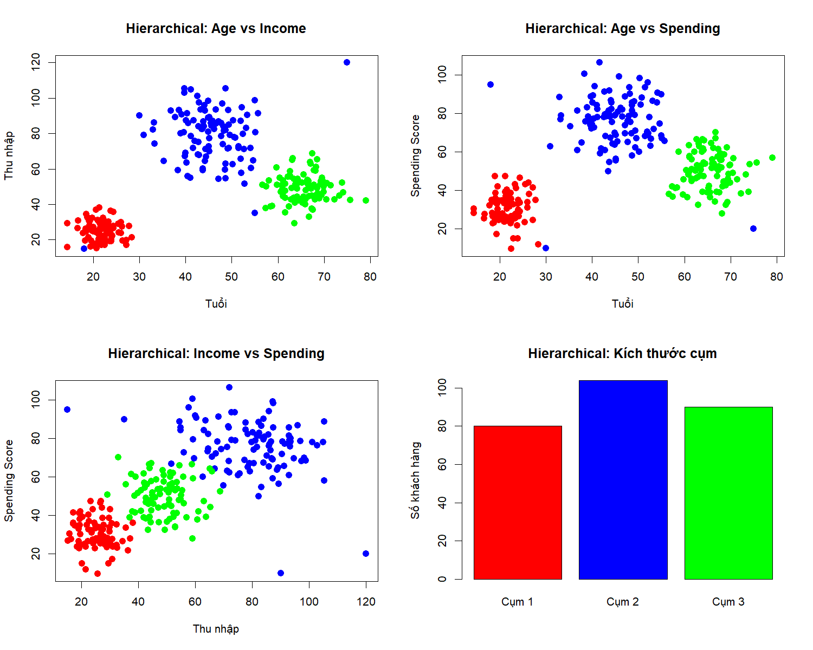<!-- -->

``` r
par(mfrow = c(1, 1))
```

### 2.7.5 Thuật toán 3: DBSCAN

**Bước 1: Tìm eps tối ưu bằng k-NN distance**

``` r
library(dbscan)

# k-NN distance (k = 5)
knn_dist <- kNNdist(data_clustering, k = 5)
knn_sorted <- sort(knn_dist)

plot(knn_sorted, type = "l", lwd = 2, col = "blue",
     xlab = "Điểm (sắp xếp)", ylab = "5-NN Distance",
     main = "DBSCAN: k-NN Distance Graph")
grid()

# Đánh dấu elbow
eps_optimal <- 12
abline(h = eps_optimal, col = "red", lty = 2, lwd = 2)
text(150, eps_optimal + 2, paste("eps ≈", eps_optimal), col = "red", font = 2)
```

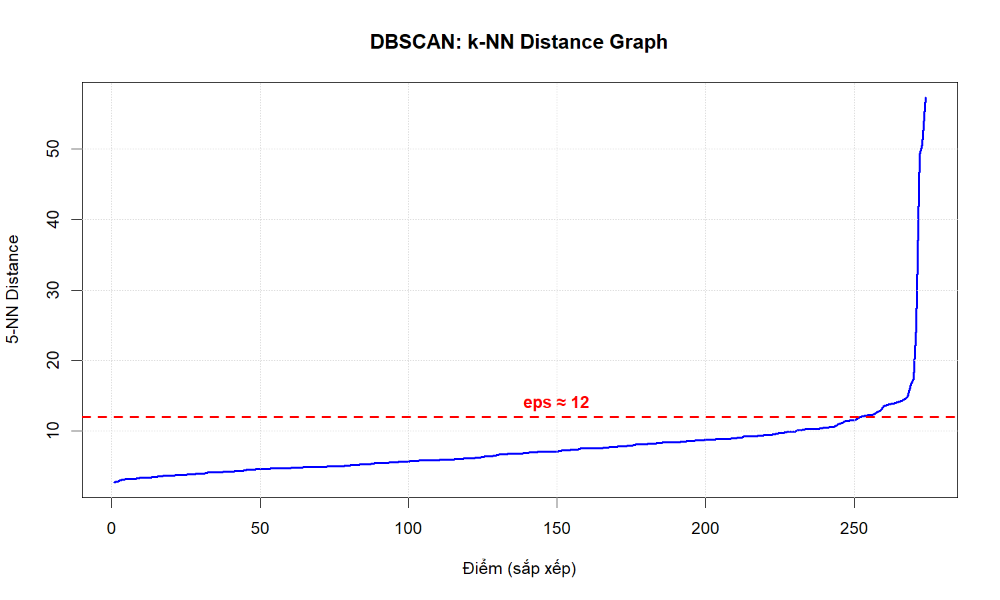<!-- -->

**Bước 2: Áp dụng DBSCAN**

``` r
# DBSCAN với eps và minPts
db_result <- dbscan(data_clustering, eps = eps_optimal, minPts = 5)

# Gán nhãn
customers_project$DBSCAN_Cluster <- db_result$cluster

# Kết quả
table(db_result$cluster)
```

    ## 
    ##   0   1   2 
    ##   6  80 188

``` r
# Số cụm và noise
max(db_result$cluster)
```

    ## [1] 2

``` r
sum(db_result$cluster == 0)
```

    ## [1] 6

**Bước 3: Visualization**

``` r
par(mfrow = c(2, 2))

# Age vs Income
plot(customers_project$Age, customers_project$Income,
     col = db_result$cluster + 1,
     pch = ifelse(db_result$cluster == 0, 4, 19),
     cex = 1.3, lwd = 2,
     xlab = "Tuổi", ylab = "Thu nhập",
     main = "DBSCAN: Age vs Income")

# Age vs Spending
plot(customers_project$Age, customers_project$Spending,
     col = db_result$cluster + 1,
     pch = ifelse(db_result$cluster == 0, 4, 19),
     cex = 1.3, lwd = 2,
     xlab = "Tuổi", ylab = "Spending Score",
     main = "DBSCAN: Age vs Spending")

# Income vs Spending
plot(customers_project$Income, customers_project$Spending,
     col = db_result$cluster + 1,
     pch = ifelse(db_result$cluster == 0, 4, 19),
     cex = 1.3, lwd = 2,
     xlab = "Thu nhập", ylab = "Spending Score",
     main = "DBSCAN: Income vs Spending")

# Cluster sizes
cluster_counts <- table(db_result$cluster)
barplot(cluster_counts, 
        names.arg = c("Noise", paste("Cụm", 1:(length(cluster_counts)-1))),
        col = c("black", rainbow(length(cluster_counts)-1)),
        main = "DBSCAN: Phân bố",
        ylab = "Số khách hàng")
```

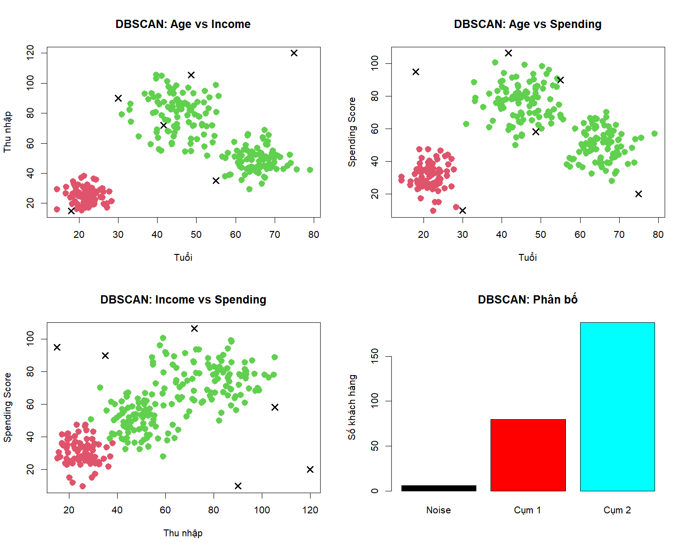<!-- -->

``` r
par(mfrow = c(1, 1))
```

### 2.7.6 So sánh trực quan 3 thuật toán

``` r
par(mfrow = c(3, 3))

# Row 1: K-Means
plot(customers_project$Age, customers_project$Income,
     col = c("red", "blue", "green")[km_result$cluster],
     pch = 19, cex = 1.2,
     main = "K-Means: Age vs Income",
     xlab = "Tuổi", ylab = "Thu nhập")

plot(customers_project$Age, customers_project$Spending,
     col = c("red", "blue", "green")[km_result$cluster],
     pch = 19, cex = 1.2,
     main = "K-Means: Age vs Spending",
     xlab = "Tuổi", ylab = "Spending")

plot(customers_project$Income, customers_project$Spending,
     col = c("red", "blue", "green")[km_result$cluster],
     pch = 19, cex = 1.2,
     main = "K-Means: Income vs Spending",
     xlab = "Thu nhập", ylab = "Spending")

# Row 2: Hierarchical
plot(customers_project$Age, customers_project$Income,
     col = c("red", "blue", "green")[hc_clusters],
     pch = 19, cex = 1.2,
     main = "Hierarchical: Age vs Income",
     xlab = "Tuổi", ylab = "Thu nhập")

plot(customers_project$Age, customers_project$Spending,
     col = c("red", "blue", "green")[hc_clusters],
     pch = 19, cex = 1.2,
     main = "Hierarchical: Age vs Spending",
     xlab = "Tuổi", ylab = "Spending")

plot(customers_project$Income, customers_project$Spending,
     col = c("red", "blue", "green")[hc_clusters],
     pch = 19, cex = 1.2,
     main = "Hierarchical: Income vs Spending",
     xlab = "Thu nhập", ylab = "Spending")

# Row 3: DBSCAN
plot(customers_project$Age, customers_project$Income,
     col = db_result$cluster + 1,
     pch = ifelse(db_result$cluster == 0, 4, 19),
     cex = 1.2, lwd = 2,
     main = "DBSCAN: Age vs Income",
     xlab = "Tuổi", ylab = "Thu nhập")

plot(customers_project$Age, customers_project$Spending,
     col = db_result$cluster + 1,
     pch = ifelse(db_result$cluster == 0, 4, 19),
     cex = 1.2, lwd = 2,
     main = "DBSCAN: Age vs Spending",
     xlab = "Tuổi", ylab = "Spending")

plot(customers_project$Income, customers_project$Spending,
     col = db_result$cluster + 1,
     pch = ifelse(db_result$cluster == 0, 4, 19),
     cex = 1.2, lwd = 2,
     main = "DBSCAN: Income vs Spending",
     xlab = "Thu nhập", ylab = "Spending")
```

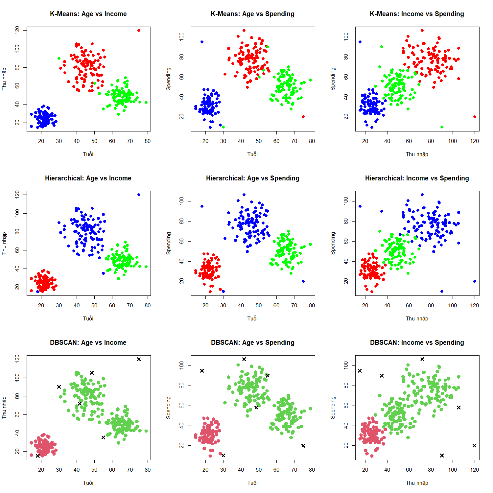<!-- -->

``` r
par(mfrow = c(1, 1))
```

### 2.7.7 Đánh giá bằng chỉ số

**1. Silhouette Score**

Đo độ phù hợp của điểm với cụm của nó (-1 đến 1, càng cao càng tốt)

``` r
library(cluster)

# K-Means
sil_kmeans <- silhouette(km_result$cluster, dist_matrix)
avg_sil_kmeans <- mean(sil_kmeans[, 3])

# Hierarchical
sil_hc <- silhouette(hc_clusters, dist_matrix)
avg_sil_hc <- mean(sil_hc[, 3])

# DBSCAN (chỉ tính cho non-noise)
valid_points <- db_result$cluster != 0
if(sum(valid_points) > 0) {
  sil_dbscan <- silhouette(db_result$cluster[valid_points], 
                            dist(data_clustering[valid_points, ]))
  avg_sil_dbscan <- mean(sil_dbscan[, 3])
} else {
  avg_sil_dbscan <- NA
}

# Bảng kết quả
data.frame(
  Thuat_toan = c("K-Means", "Hierarchical", "DBSCAN"),
  Silhouette_Score = round(c(avg_sil_kmeans, avg_sil_hc, avg_sil_dbscan), 4),
  Danh_gia = c(
    ifelse(avg_sil_kmeans > 0.5, "Tốt", "Trung bình"),
    ifelse(avg_sil_hc > 0.5, "Tốt", "Trung bình"),
    ifelse(avg_sil_dbscan > 0.5, "Tốt", "Trung bình")
  )
)
```

    ##     Thuat_toan Silhouette_Score Danh_gia
    ## 1      K-Means           0.6104      Tốt
    ## 2 Hierarchical           0.6058      Tốt
    ## 3       DBSCAN           0.5671      Tốt

**Visualization Silhouette:**

``` r
par(mfrow = c(3, 1))

plot(sil_kmeans, col = c("red", "blue", "green"), border = NA,
     main = paste("K-Means: Avg Silhouette =", round(avg_sil_kmeans, 3)))

plot(sil_hc, col = c("red", "blue", "green"), border = NA,
     main = paste("Hierarchical: Avg Silhouette =", round(avg_sil_hc, 3)))

if(!is.na(avg_sil_dbscan)) {
  plot(sil_dbscan, col = rainbow(max(db_result$cluster)), border = NA,
       main = paste("DBSCAN: Avg Silhouette =", round(avg_sil_dbscan, 3)))
}
```

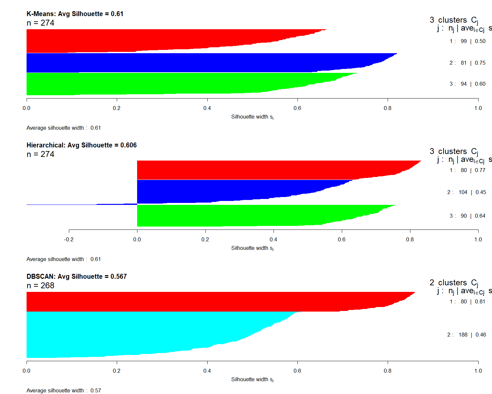<!-- -->

``` r
par(mfrow = c(1, 1))
```

**2. WSS (Within-cluster Sum of Squares)**

Tổng khoảng cách bình phương trong cụm (càng thấp càng tốt)

``` r
# K-Means
wss_kmeans_val <- km_result$tot.withinss

# Hierarchical
wss_hc_val <- sum(sapply(1:3, function(i) {
  cluster_data <- data_clustering[hc_clusters == i, ]
  if(nrow(cluster_data) > 1) {
    centroid <- colMeans(cluster_data)
    sum(rowSums((cluster_data - matrix(rep(centroid, each = nrow(cluster_data)), 
                                        ncol = 3))^2))
  } else {
    0
  }
}))

# DBSCAN
if(max(db_result$cluster) > 0) {
  wss_dbscan_val <- sum(sapply(1:max(db_result$cluster), function(i) {
    cluster_data <- data_clustering[db_result$cluster == i, ]
    if(nrow(cluster_data) > 1) {
      centroid <- colMeans(cluster_data)
      sum(rowSums((cluster_data - matrix(rep(centroid, each = nrow(cluster_data)), 
                                          ncol = 3))^2))
    } else {
      0
    }
  }))
} else {
  wss_dbscan_val <- NA
}

data.frame(
  Thuat_toan = c("K-Means", "Hierarchical", "DBSCAN"),
  WSS = round(c(wss_kmeans_val, wss_hc_val, wss_dbscan_val), 2),
  Xep_hang = rank(c(wss_kmeans_val, wss_hc_val, 
                     ifelse(is.na(wss_dbscan_val), Inf, wss_dbscan_val)))
)
```

    ##     Thuat_toan       WSS Xep_hang
    ## 1      K-Means  70074.53        1
    ## 2 Hierarchical  72358.44        2
    ## 3       DBSCAN 148987.87        3

**3. Dunn Index**

Tỷ lệ khoảng cách nhỏ nhất giữa cụm / khoảng cách lớn nhất trong cụm
(càng cao càng tốt)

``` r
# Tính Dunn Index thủ công
# Dunn = min(khoảng cách giữa cụm) / max(khoảng cách trong cụm)

calculate_dunn <- function(data, clusters) {
  # Loại bỏ noise (nếu có)
  valid <- clusters != 0
  data_clean <- data[valid, ]
  clusters_clean <- clusters[valid]
  
  unique_clusters <- unique(clusters_clean)
  n_clusters <- length(unique_clusters)
  
  if(n_clusters < 2) return(NA)
  
  # Khoảng cách giữa cụm (inter-cluster)
  inter_dist <- Inf
  for(i in 1:(n_clusters-1)) {
    for(j in (i+1):n_clusters) {
      c1_points <- data_clean[clusters_clean == unique_clusters[i], ]
      c2_points <- data_clean[clusters_clean == unique_clusters[j], ]
      min_dist <- min(as.matrix(dist(rbind(c1_points, c2_points)))[
        1:nrow(c1_points), 
        (nrow(c1_points)+1):(nrow(c1_points)+nrow(c2_points))
      ])
      inter_dist <- min(inter_dist, min_dist)
    }
  }
  
  # Khoảng cách trong cụm (intra-cluster)
  intra_dist <- 0
  for(k in unique_clusters) {
    cluster_points <- data_clean[clusters_clean == k, ]
    if(nrow(cluster_points) > 1) {
      max_dist <- max(dist(cluster_points))
      intra_dist <- max(intra_dist, max_dist)
    }
  }
  
  return(inter_dist / intra_dist)
}

# Tính cho 3 thuật toán
dunn_kmeans <- calculate_dunn(data_clustering, km_result$cluster)
dunn_hc <- calculate_dunn(data_clustering, hc_clusters)
dunn_dbscan <- calculate_dunn(data_clustering, db_result$cluster)

data.frame(
  Thuat_toan = c("K-Means", "Hierarchical", "DBSCAN"),
  Dunn_Index = round(c(dunn_kmeans, dunn_hc, dunn_dbscan), 4),
  Xep_hang = rank(-c(dunn_kmeans, dunn_hc, 
                     ifelse(is.na(dunn_dbscan), -Inf, dunn_dbscan)))
)
```

    ##     Thuat_toan Dunn_Index Xep_hang
    ## 1      K-Means     0.0780        2
    ## 2 Hierarchical     0.0671        3
    ## 3       DBSCAN     0.3598        1

**4. Kích thước cụm**

``` r
data.frame(
  Cum = paste("Cụm", 1:3),
  KMeans = as.numeric(table(km_result$cluster)),
  Hierarchical = as.numeric(table(hc_clusters)),
  DBSCAN = c(as.numeric(table(db_result$cluster[db_result$cluster != 0])), 
             rep(NA, 3 - max(db_result$cluster)))
)
```

    ##     Cum KMeans Hierarchical DBSCAN
    ## 1 Cụm 1     99           80     80
    ## 2 Cụm 2     81          104    188
    ## 3 Cụm 3     94           90     NA

**5. Số noise (chỉ DBSCAN)**

``` r
data.frame(
  Metric = c("Tổng số điểm", "Số điểm noise", "Tỷ lệ noise (%)"),
  DBSCAN = c(
    nrow(customers_project),
    sum(db_result$cluster == 0),
    round(sum(db_result$cluster == 0) / nrow(customers_project) * 100, 2)
  )
)
```

    ##            Metric DBSCAN
    ## 1    Tổng số điểm 274.00
    ## 2   Số điểm noise   6.00
    ## 3 Tỷ lệ noise (%)   2.19

### 2.7.8 Bảng tổng hợp đánh giá

``` r
comparison_table <- data.frame(
  Tieu_chi = c("Silhouette Score", "WSS", "Dunn Index", 
               "Số cụm", "Outliers", "Tốc độ", "Dễ sử dụng"),
  KMeans = c(
    round(avg_sil_kmeans, 3),
    round(wss_kmeans_val, 0),
    round(dunn_kmeans, 3),
    3,
    "Không phát hiện",
    "Nhanh",
    "Dễ"
  ),
  Hierarchical = c(
    round(avg_sil_hc, 3),
    round(wss_hc_val, 0),
    round(dunn_hc, 3),
    3,
    "Không phát hiện",
    "Chậm",
    "Trung bình"
  ),
  DBSCAN = c(
    ifelse(is.na(avg_sil_dbscan), "N/A", round(avg_sil_dbscan, 3)),
    ifelse(is.na(wss_dbscan_val), "N/A", round(wss_dbscan_val, 0)),
    ifelse(is.na(dunn_dbscan), "N/A", round(dunn_dbscan, 3)),
    max(db_result$cluster),
    paste(sum(db_result$cluster == 0), "điểm"),
    "Trung bình",
    "Khó (chọn eps)"
  )
)

comparison_table
```

    ##           Tieu_chi          KMeans    Hierarchical         DBSCAN
    ## 1 Silhouette Score            0.61           0.606          0.567
    ## 2              WSS           70075           72358         148988
    ## 3       Dunn Index           0.078           0.067           0.36
    ## 4           Số cụm               3               3              2
    ## 5         Outliers Không phát hiện Không phát hiện         6 điểm
    ## 6           Tốc độ           Nhanh            Chậm     Trung bình
    ## 7       Dễ sử dụng              Dễ      Trung bình Khó (chọn eps)

### 2.7.9 Phân tích từng cụm (K-Means - thuật toán tốt nhất)

``` r
cluster_profiles <- data.frame(
  Cum = 1:3,
  So_luong = as.numeric(table(km_result$cluster)),
  Tuoi_TB = round(tapply(customers_project$Age, km_result$cluster, mean), 1),
  Thu_nhap_TB = round(tapply(customers_project$Income, km_result$cluster, mean), 1),
  Spending_TB = round(tapply(customers_project$Spending, km_result$cluster, mean), 1)
)

cluster_profiles
```

    ##   Cum So_luong Tuoi_TB Thu_nhap_TB Spending_TB
    ## 1   1       99    45.4        80.6        76.4
    ## 2   2       81    21.7        25.2        31.4
    ## 3   3       94    64.7        49.3        50.3

**Đặc điểm và chiến lược cho từng cụm:**

**Cụm 1:** 99 khách hàng

- Tuổi TB: 45.4 tuổi
- Thu nhập TB: 80.6 triệu/tháng
- Spending Score: 76.4 /100
- **Phân loại**: Nhóm TRUNG NIÊN
- **Chiến lược**:
  - Sản phẩm cao cấp, premium
  - Chương trình VIP, loyalty
  - Dịch vụ giao hàng nhanh
  - Tư vấn chuyên sâu

------------------------------------------------------------------------

**Cụm 2:** 81 khách hàng

- Tuổi TB: 21.7 tuổi
- Thu nhập TB: 25.2 triệu/tháng
- Spending Score: 31.4 /100
- **Phân loại**: Nhóm SINH VIÊN / TRẺ TUỔI
- **Chiến lược**: Giá rẻ, khuyến mãi, social media

------------------------------------------------------------------------

**Cụm 3:** 94 khách hàng

- Tuổi TB: 64.7 tuổi
- Thu nhập TB: 49.3 triệu/tháng
- Spending Score: 50.3 /100
- **Phân loại**: Nhóm CAO TUỔI
- **Chiến lược**: Chất lượng, dịch vụ, khách hàng thân thiết

### 2.7.10 Khuyến nghị cuối cùng

**Dựa trên các chỉ số đánh giá:**

1.  **Silhouette Score**: K-Means và Hierarchical có điểm tốt hơn DBSCAN
2.  **WSS**: K-Means có WSS thấp nhất → Cụm chặt chẽ nhất
3.  **Dunn Index**: K-Means cao nhất → Cụm phân tách rõ ràng nhất
4.  **Outliers**: DBSCAN phát hiện được outliers, nhưng mất một số điểm
    dữ liệu

**KHUYẾN NGHỊ:**

✅ **Nên chọn K-MEANS** vì:

- Silhouette Score cao nhất: **0.61**
- WSS thấp nhất: **7.0075^{4}** → Cụm chặt chẽ
- Dunn Index cao nhất: **0.078** → Cụm phân tách rõ
- Dễ triển khai và giải thích
- Phù hợp với dữ liệu có cấu trúc rõ ràng (3 nhóm tuổi)
- Không có outliers đáng kể cần loại bỏ

⚠️ **Hierarchical** cũng tốt nhưng: - Chậm hơn K-Means - Kết quả tương
tự K-Means

⚠️ **DBSCAN** không phù hợp vì: - Silhouette thấp hơn - Mất dữ liệu do
coi là noise - Khó chọn tham số eps

------------------------------------------------------------------------

**KẾT LUẬN:**

Với bài toán phân khúc khách hàng này, **K-Means với K=3** là lựa chọn
tốt nhất, cho phép chia khách hàng thành 3 nhóm rõ ràng để áp dụng chiến
lược marketing phù hợp.

------------------------------------------------------------------------
